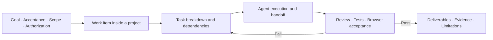
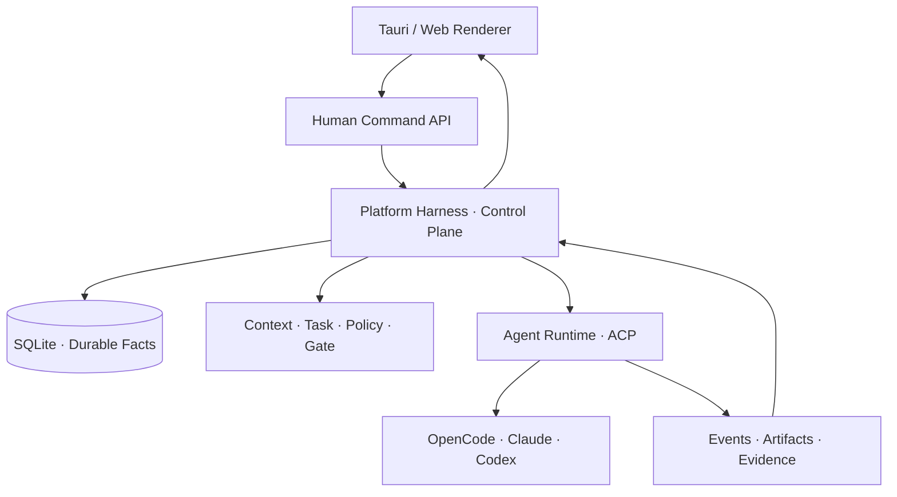

<div align="center">
  <sub><b>English</b> · <a href="./README.md">简体中文</a></sub>
  <h1>Agent Task Hub</h1>
  <h3>An Agent OS for software delivery</h3>
  <p><strong>Organize Claude, Codex, and OpenCode into an agent team that keeps working.</strong></p>
  <p>Define the goal and acceptance once. Let the team continue until it delivers evidence.</p>
  <p><sub>Developer Preview · Desktop + Web · Local-first</sub></p>
  
  <p>
    <a href="./docs/assets/demo/agent-task-hub-e2e-walkthrough.mp4"><strong>▶ Watch the 44-second desktop demo</strong></a>
    · <a href="#-quick-start"><strong>Quick start</strong></a>
  </p>
  <p>
    <a href="#-the-problem">Why</a> ·
    <a href="#-from-goal-to-evidence">How it works</a> ·
    <a href="#-product-model">Product model</a> ·
    <a href="#-architecture">Architecture</a> ·
    <a href="#-project-status">Status</a> ·
    <a href="#-documentation">Docs</a>
  </p>
</div>

---

## 🎬 End-to-end demo

This desktop walkthrough covers the full path: connect a local project → create a work item → let Mario orchestrate the breakdown → execute along task dependencies → run independent review and browser acceptance → organize deliverables by contributor → close with evidence.

<div align="center">
  <a href="./docs/assets/demo/agent-task-hub-e2e-walkthrough.mp4">
    
  </a>
  <p><sub>Click the animated preview for the full-resolution MP4 · Real product UI · Local paths redacted</sub></p>
</div>

---

## 🎯 The problem

Coding agents are already good at producing code. The harder problem is keeping multi-step, multi-role work aligned with one goal across failures until the result is actually verifiable.

| Common failure | Agent Task Hub's response |
| --- | --- |
| Goals and context drift inside long chats | Assemble project knowledge, task context, and Skills on demand |
| Several agents run, but nobody owns the next step | Use a task graph with owners and dependencies to make possession explicit |
| A session, process, or tool fails and work starts over | Persist critical facts, recover from the original workspace, retry, and reconcile |
| An agent says “done” without a verifiable result | Apply review, tests, browser acceptance, or external receipts according to task risk |
| Every issue and discussion lands in one chat | Layer work items under a Project, each with its own activity and deliverables |

**This is not a UI with more chat windows. It is scheduling, context, communication, recovery, and quality control for an agent team.**

---

## 🔁 From goal to evidence



Humans own the goal, taste, boundaries, and high-risk decisions. The system makes sure the right role receives the right work, failures can recover, and completion requires evidence.

---

## 🧭 Product model

```text
Workspace
└── Project                         Long-lived code boundary, team, knowledge, permissions
    ├── Work Item                   One issue, change, or improvement
    │   ├── Task / Subtask          Executable work, owner, dependencies, status
    │   ├── Activity                Discussion and runtime facts for this work only
    │   ├── Deliverables            Columns by contributor, then grouped by type
    │   └── Review & Evidence       Review, tests, acceptance, completion proof
    └── Project Overview            Read-only cross-work summary, not a global chat
```

The Project owns durable context, a Work Item owns one outcome, and Tasks own execution. Issues, agent replies, and artifacts do not collapse into one shared conversation.

---

## 👥 How the default team collaborates

| Role | Default agent | Primary responsibility |
| --- | --- | --- |
| Navigator | Mario | Understand the goal, break down work, order dependencies, close the loop |
| Architect | DK | Check architecture, data, security, and performance boundaries |
| Builder | Luigi | Implement, debug, test, and register change evidence |
| Verifier | Peach | Perform independent review, end-to-end acceptance, and quality decisions |

Collaboration does not depend on agents remembering to cooperate. The system persists and constrains ownership, structured handoffs, isolated sessions, work-directory boundaries, quality gates, and recovery policy; explicit Git mode can additionally enable worktree isolation. Roles, models, accounts, and Skills are configurable per project.

---

## ✨ Current capabilities

| Capability area | What exists in this repository |
| --- | --- |
| Projects and work | Project / Work Item / Task hierarchy with separate overview and per-work activity |
| Collaboration and scheduling | Task graphs with owners and dependencies, structured agent handoffs, and durable work requests |
| Agent execution | One ACP path for OpenCode, Claude, and Codex with replaceable local execution |
| Context and capabilities | Project knowledge, role configuration, Skills, accounts, and task context assembled per role |
| Delivery and quality | Contributor-first artifacts; review, tests, browser acceptance, or receipt gates selected by task risk |
| State and recovery | SQLite durable facts, idempotent commands, leases, and foundations for retries, recovery, and reconciliation |
| Observability and evaluation | Traceable invocations, events, evidence, and evaluation records for regression comparison |
| Desktop development host | Tauri Host + local Node Service with verified Windows release cold start and single instance |

### Still being hardened

- Windows installers, signing, automatic updates, and the cross-platform release matrix;
- overall completion-rate, path-convergence, and efficiency baselines on a fixed task suite;
- remote execution nodes and more external work sources;
- long-running failure recovery and end-to-end release gates.

Agent Task Hub is currently a **developer preview** for local trials, research, and collaboration. There is no downloadable production release yet.

---

## ⚖️ How it differs from a typical coding agent

| | Typical coding agent | Agent Task Hub |
| --- | --- | --- |
| Primary object | A chat or invocation | A delivery with a goal, acceptance, and authorization |
| Collaboration | Manual context copy or temporary subagents | Stable roles, task graphs with owners and dependencies, structured handoffs |
| State | Mostly the current session | Durable facts, revisions, leases, and recovery |
| Completion | Agent self-report or process exit | Review, tests, acceptance, or external outcomes matched to task risk |
| Human role | Continuous reminders and manual scheduling | Define the goal; handle only necessary decisions |
| Improvement | Change the prompt or model | Versioned Skills, knowledge, role configuration, and evaluations |

---

## 🚀 Quick start

### Requirements

- Git
- Node.js 20.19+ (use a current LTS release)
- pnpm 10.33.2
- At least one available agent engine: OpenCode, Claude, or Codex

### Run the web development build

```bash
git clone https://github.com/changhuaqiu/agent-task-team.git
cd agent-task-team
corepack enable
pnpm install
pnpm dev
```

Open [http://localhost:3000](http://localhost:3000). If Corepack is unavailable, run `npm install -g pnpm@10.33.2`.

Production build:

```bash
pnpm build
pnpm start
```

### Build the desktop development app

Desktop builds additionally require Rust stable, the Tauri 2 platform dependencies, and WebView2 on Windows:

```bash
pnpm desktop:build
```

On Windows, the release executable is written to `src-tauri/target/release/agent-task-hub-desktop.exe`. This is a development acceptance build, not a signed production distribution with automatic updates.

### First run

1. Connect and verify an OpenCode, Claude, or Codex account in Settings.
2. Create a Project and select the local code directory and agent team.
3. Create a Work Item and describe the goal, constraints, and acceptance focus in its description.
4. Follow task orchestration and execution; handle only exceptions that require your judgment.
5. Verify the final result through deliverables and completion evidence.

---

## 🏗️ Architecture



| Layer | Main technology | Responsibility |
| --- | --- | --- |
| Experience | Next.js 16, React 19, Tauri 2 | Project workspace, desktop host, read-only runtime projections |
| Control | Next.js API, Platform Harness | Commands, Task authority, dispatch, policy, gates, recovery |
| Execution | ACP, Socket.io, CLI processes | Start agents, stream events, run tools, report lifecycle |
| Data | SQLite, repositories, event/proof records | Durable state, idempotency, audit, artifacts, evaluation evidence |

### Repository map

| Path | Contents |
| --- | --- |
| `src/app/`, `src/components/` | Renderer shared by web and desktop |
| `src/server/` | Control plane, execution orchestration, persistence, domain services |
| `src/lib/team-runtime/` | Team, role, model, account, and Skill resolution |
| `src-tauri/` | Desktop Host and local Service packaging |
| `e2e/` | Playwright end-to-end verification |
| `specs/` | Active implementation contracts |
| `docs/` | Product, technical, evaluation, knowledge, and historical documentation |

→ [Read the full architecture](./docs/wiki/01-architecture.md)

---

## ✅ Verification

```bash
pnpm lint
pnpm test
pnpm build
pnpm e2e
```

The project distinguishes tests, real browser acceptance, review receipts, and runtime evidence, then applies them according to task risk. A successful build proves buildability; it does not prove that the user's goal is complete.

---

## 🗺️ Project status

Agent Task Hub is converging from a local multi-agent workspace into a complete Agent OS for software delivery. Active specs are the source of truth for current engineering work; this README keeps only stable positioning and verified capabilities instead of presenting target-state design as complete.

- [Current roadmap](./docs/roadmap.md)
- [Active specs](./specs/README.md)
- [Verified product changes and evidence](./docs/product/STORY.md)

---

## 📚 Documentation

| Document | Best for |
| --- | --- |
| [Product vision](./docs/product/vision.md) | Why software delivery needs an Agent OS |
| [Product stories](./docs/product/STORY.md) | User problems, visible changes, verification evidence |
| [System architecture](./docs/wiki/01-architecture.md) | Current layers, data flow, execution path |
| [Platform Harness](./docs/technical/execution/platform-harness-state-machine-design.md) | Autonomous progress, state machine, control boundaries |
| [Desktop Host](./docs/technical/execution/desktop-host-target-architecture.md) | Tauri, Service, lifecycle, release boundaries |
| [Agent evaluation](./docs/technical/evaluation/README.md) | How completion, path, and efficiency are measured |
| [Development guide](./docs/sop.md) | Development and contribution workflow |
| [Full documentation index](./docs/README.md) | All product, technical, spec, and knowledge documents |

---

## 🤝 Contributing

Bug reports, product proposals, documentation, and code contributions are welcome. Read the [Agent / contributor constraints](./AGENTS.md) first, and attach reproducible verification evidence to every change.

---

<div align="center">
  <h3>Define the goal once. Deliver it with evidence.</h3>
  <p><sub>From goal to evidence.</sub></p>
</div>
