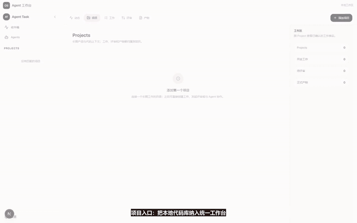
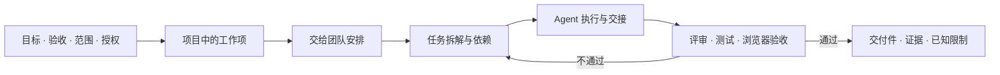
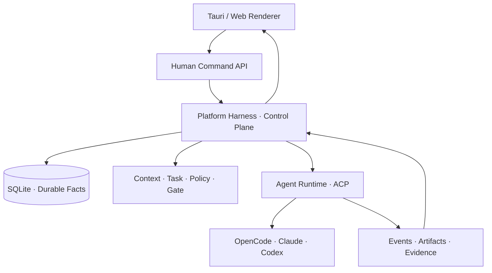

<div align="center">
  <sub><a href="./README.en.md">English</a> · <b>简体中文</b></sub>
  <h1>Agent Task Hub</h1>
  <h3>面向软件交付的 Agent OS</h3>
  <p><strong>把 Claude、Codex、OpenCode 组织成一支能持续工作的 Agent 团队。</strong></p>
  <p>一次说清目标和验收，团队持续推进，直到有证据地交付。</p>
  <p><sub>Developer Preview · Desktop + Web · Local-first</sub></p>
  
  <p>
    <a href="./docs/assets/demo/agent-task-hub-e2e-walkthrough.mp4"><strong>▶ 观看 44 秒实机演示</strong></a>
    · <a href="#-快速开始"><strong>快速开始</strong></a>
  </p>
  <p>
    <a href="#-它解决什么">为什么做</a> ·
    <a href="#-从目标到证据">工作方式</a> ·
    <a href="#-产品对象与层级">产品模型</a> ·
    <a href="#-技术架构">架构</a> ·
    <a href="#-项目状态">项目状态</a> ·
    <a href="#-文档导航">文档</a>
  </p>
</div>

---

## 🎬 端到端演示

这段桌面端实机演示覆盖完整路径：接入本地项目 → 创建工作项 → Mario 统筹拆解 → Agent 按依赖执行 → 独立评审与浏览器验收 → 按角色归类交付件 → 证据化完成。

<div align="center">
  <a href="./docs/assets/demo/agent-task-hub-e2e-walkthrough.mp4">
    
  </a>
  <p><sub>点击动态预览播放高清 MP4 · 真实产品界面 · 本地路径已脱敏</sub></p>
</div>

---

## 🎯 它解决什么

Coding Agent 已经很会写代码，真正困难的是让一项工作跨越多个步骤、多个角色和多次失败后，仍然沿着同一目标走到可验收结果。

| 常见断点 | Agent Task Hub 的处理方式 |
| --- | --- |
| 长对话让目标和上下文逐渐漂移 | 项目知识、任务上下文和 Skill 按需装配 |
| 多个 Agent 同时运行，但没人真正负责下一步 | 带负责人和依赖的任务图明确当前持有者 |
| 会话、进程或工具失败后只能重新开始 | 关键事实持久化，按现场恢复、重试和对账 |
| Agent 说“完成了”，却没有可验证结果 | 按任务与风险选择评审、测试、浏览器验收或外部回执来判定完成 |
| 所有 Issue 和讨论混在一条聊天里 | Project 下按工作项分层，每项工作独立持有活动和交付件 |

**它不是多开几个聊天窗口，而是为 Agent 团队补上调度、上下文、通信、恢复和质量门。**

---

## 🔁 从目标到证据



人负责目标、品味、边界和高风险决策；系统负责让正确工作被正确角色接住，让失败能够恢复，让“完成”必须有证据。

实际使用只需要沿着四步走：

1. **创建目标**：接入项目目录，创建工作项，写清目标与验收。创建只保存目标，不代表已经执行。
2. **交给团队安排**：确认统筹者和账号来源，再明确交给团队。提交回执不等于 Agent 已经开始运行。
3. **只处理需要你的事**：概览显示当前阻塞，直接打开对应任务检查、补充材料或重试；重试不会替你扩大权限。
4. **查收成果与验收**：按贡献角色与类别看交付件、预览内容，并核对验收人、版本、证据和已知限制。

这些入口也适用于已有项目与旧工作项，无需重建。历史记录缺少验收证据时会明确提示；文件已登记、任务已完成和验收已通过是不同事实。预览展示的是当前文件，不会冒充当时的冻结版本。详见[全流程体验评测](docs/technical/evaluation/2026-09-06-ux-journey-evaluation.md)。

---

## 🧭 产品对象与层级

```text
Workspace
└── Project                         长期代码边界、团队、知识与权限
    ├── Work Item / 工作项           一次 Issue、变更或改进
    │   ├── Task / Subtask           可执行任务、负责人、依赖与状态
    │   ├── Activity                 只属于这项工作的讨论和运行事实
    │   ├── Deliverables             按贡献角色分列，再按类型归类
    │   └── Review & Evidence        评审、测试、验收与完成证明
    └── Project Overview             跨工作项只读汇总，不是公共群聊
```

这个层级让项目负责长期上下文，让工作项负责单次目标，让任务负责执行；Issue、Agent 回复和交付件不会再挤进同一个聊天区。

---

## 👥 默认团队如何协作

| 角色 | 默认 Agent | 主要责任 |
| --- | --- | --- |
| Navigator | Mario | 理解目标、拆解任务、安排依赖、统筹收口 |
| Architect | DK | 校验架构、数据、安全与性能边界 |
| Builder | Luigi | 实现、调试、测试并登记变更证据 |
| Verifier | Peach | 独立评审、端到端验收和质量结论 |

团队不是靠“自觉配合”：任务责任、结构化交接、独立会话、工作目录边界、质量门和恢复策略都由系统保存和约束；显式 Git 模式还可启用 worktree 隔离。角色、模型、账号和 Skill 可以按项目配置。

---

## ✨ 当前能力

| 能力面 | 当前仓库中的实现 |
| --- | --- |
| 项目与工作项 | Project / Work Item / Task 分层，项目概览与单工作活动分离 |
| 协作与调度 | 带负责人和依赖的任务图、Agent 间结构化交接和持久工作请求 |
| Agent 执行 | 统一 ACP 接入 OpenCode、Claude 和 Codex，本地执行链可替换 |
| 上下文与能力 | 项目知识、角色配置、Skill、账号和任务上下文按角色装配 |
| 交付与质量 | 交付件按角色组织；按任务与风险装配评审、测试、浏览器验收或回执门禁 |
| 状态与恢复 | SQLite 持久事实、幂等命令、租约、重试、恢复和对账基础 |
| 可观测与评估 | Invocation、事件、证据和评估记录可追踪，支持回归比较 |
| 桌面开发版 | Tauri Host + 本地 Node Service，已验证 Windows release 冷启动和单实例 |

### 仍在强化

- Windows 安装包、签名、自动更新和跨平台发布矩阵；
- 固定任务集上的整体完成率、路径收敛和效率基线；
- 远端执行节点及更多外部任务来源；
- 长周期异常恢复与端到端发布门禁。

当前是**开发者预览版**，适合本地试用、研究和共同开发；尚未发布可直接下载的正式安装版本。

---

## ⚖️ 与常见 Coding Agent 的区别

| | 常见 Coding Agent | Agent Task Hub |
| --- | --- | --- |
| 一等对象 | 一次对话或调用 | 一次带目标、验收和授权的交付 |
| 协作 | 人工复制上下文或临时子 Agent | 稳定角色、带负责人和依赖的任务图、结构化交接 |
| 状态 | 主要依赖当前会话 | 持久事实、版本、租约和恢复 |
| 完成判断 | Agent 自述或进程结束 | 与任务风险匹配的评审、测试、验收或外部结果 |
| 人的角色 | 持续提醒和人工调度 | 定义目标，只处理必要决策 |
| 团队成长 | 更换 Prompt 或模型 | Skill、知识、角色配置与评估的版本闭环 |

---

## 🚀 快速开始

### 环境要求

- Git
- Node.js 20.19+（建议使用当前 LTS）
- pnpm 10.33.2
- 至少一个可用的 Agent 执行端：OpenCode、Claude 或 Codex

### 启动 Web 开发版

```bash
git clone https://github.com/changhuaqiu/agent-task-team.git
cd agent-task-team
corepack enable
pnpm install
pnpm dev
```

打开 [http://localhost:3000](http://localhost:3000)。如果本机没有 Corepack，可运行 `npm install -g pnpm@10.33.2`。

生产构建：

```bash
pnpm build
pnpm start
```

### 构建桌面开发版

桌面构建还需要 Rust stable、Tauri 2 对应平台依赖，以及 Windows 上的 WebView2：

```bash
pnpm desktop:build
```

Windows release 可执行文件位于 `src-tauri/target/release/agent-task-hub-desktop.exe`。当前桌面构建用于开发验收，不等同于已签名、可自动更新的正式发行版。

### 第一次使用

1. 在设置中连接并验证一个 OpenCode、Claude 或 Codex 账号；
2. 创建 Project，选择本地代码目录和 Agent 团队；
3. 创建工作项，在说明中写清目标、约束和验收重点；
4. 观察任务拆解与执行，只处理真正需要你判断的异常；
5. 从交付件和完成证据核对最终结果。

---

## 🏗️ 技术架构



| 层 | 主要技术 | 职责 |
| --- | --- | --- |
| 体验层 | Next.js 16、React 19、Tauri 2 | 项目工作台、桌面 Host、只读运行投影 |
| 控制层 | Next.js API、Platform Harness | 命令、任务权威、分派、策略、质量门和恢复 |
| 执行层 | ACP、Socket.io、CLI 进程 | 启动 Agent、流式事件、工具调用和生命周期 |
| 数据层 | SQLite、Repository、Event/Proof | 持久状态、幂等、审计、交付件和评估证据 |

### 仓库地图

| 路径 | 内容 |
| --- | --- |
| `src/app/`、`src/components/` | Web / Desktop 共用 Renderer |
| `src/server/` | 控制面、执行编排、持久化和领域服务 |
| `src/lib/team-runtime/` | 团队、角色、模型、账号和 Skill 解析 |
| `src-tauri/` | 桌面 Host 与本地 Service 打包 |
| `e2e/` | Playwright 端到端验证 |
| `specs/` | 当前仍有效的实现契约 |
| `docs/` | 产品、技术、评估、知识与历史文档 |

→ [阅读完整架构](./docs/wiki/01-architecture.md)

---

## ✅ 验证

```bash
pnpm lint
pnpm test
pnpm build
pnpm e2e
```

仓库将测试、真实浏览器验收、评审回执和运行证据区分开，并按任务与风险选用：构建通过只证明可构建，不等于用户目标已经完成。

---

## 🗺️ 项目状态

Agent Task Hub 正在从本地多 Agent 工作台收敛为完整的软件交付 Agent OS。当前开发重点以活动规格为准，README 只保留稳定定位和已验证能力，避免把目标状态写成已经完成。

- [当前路线图](./docs/roadmap.md)
- [活动规格](./specs/README.md)
- [真实产品变化与证据](./docs/product/STORY.md)

---

## 📚 文档导航

| 文档 | 适合了解什么 |
| --- | --- |
| [产品愿景](./docs/product/vision.md) | 为什么需要软件交付 Agent OS |
| [产品故事](./docs/product/STORY.md) | 用户问题、可感知变化与验证证据 |
| [整体架构](./docs/wiki/01-architecture.md) | 当前系统分层、数据流与执行链 |
| [Platform Harness](./docs/technical/execution/platform-harness-state-machine-design.md) | 自主推进、状态机和控制边界 |
| [桌面 Host](./docs/technical/execution/desktop-host-target-architecture.md) | Tauri、Service、生命周期与发布边界 |
| [Agent 评估](./docs/technical/evaluation/README.md) | 完成率、路径和效率如何评测 |
| [开发规范](./docs/sop.md) | 开发与贡献流程 |
| [完整文档索引](./docs/README.md) | 全部产品、技术、规格和知识资料 |

---

## 🤝 参与贡献

欢迎提交 Bug、产品建议、文档和代码。开始前请阅读 [Agent / Contributor 约束](./AGENTS.md)，并为变更附上可复核的验证证据。

---

<div align="center">
  <h3>一次说清目标，直到有证据地交付。</h3>
  <p><sub>From goal to evidence.</sub></p>
</div>
