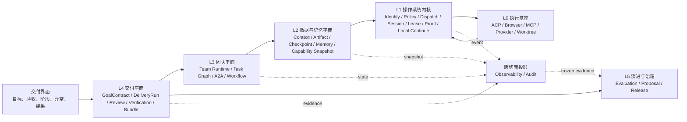

# Agent OS 顶层设计对照审计

> 日期：2026-07-20
> 状态：Design Review；用于统一方向，不替代活动规格
> 参考：[从 Prompt 到 Harness：企业级 Agent 工程的完整演进之路](https://mp.weixin.qq.com/s/xH4cyBJJJlG9cfcmSU5ztA)

## 1. 结论

Agent Task Hub 已经具备 Agent OS 的主要雏形，不应再把自己定义成“多 Agent 聊天或编排平台”。

当前系统已经落地的基线包括：

- 可替换的执行引擎与工作目录；
- 持久化 Session、Invocation、Task 和 Proof；
- Harness 主链的场景化上下文编译与预算；
- Team Runtime 与 Task Graph；
- 自主交付状态机与完成门禁；
- Trace/Span 可观测和 Agent 评估主链。

已经建立主链但仍在收口的能力包括：

- Control Plane 的唯一执行入口、定向路由和 ACK；
- A2A 责任持有、交接和 ContextManager 统一注入；
- Autonomous Delivery 的恢复、预算和完整发布验收；
- Evaluation 的人工校准与受治理发布闭环。

问题不在于缺少更多功能，而在于这些能力仍分散在 Harness、Control Plane、Context、A2A、Autonomous Delivery 和 Evaluation 多套设计中，尚未完全形成一套边界稳定、事实权威唯一的操作系统。

顶层定位应固定为：

> **Agent Task Hub 是面向软件交付的 Agent OS；Team Harness 是它的执行内核。**

下一阶段的首要工作不是增加 Agent 数量、Workflow 类型或工具数量，而是完成三个收敛：

1. **内核收敛**：所有执行意图经过同一个服务端控制面；
2. **数据收敛**：Agent 间传递类型化产物引用，而不是靠模型搬运文本；
3. **演进收敛**：Skill、RoleCard、策略和 Agent 版本通过评估、灰度与回退进入生产。

## 2. 文章真正值得学习的顶层思想

文章的价值不在“五层”这个数字，而在以下系统原则。

### 2.1 模型是 CPU，不是完整系统

模型擅长意图理解、规划、推理和生成，但不天然拥有：

- 内存管理；
- 进程调度；
- 持久化文件系统；
- 进程间通信；
- 权限与故障隔离；
- 可恢复执行；
- 发布与进化治理。

因此，模型能力增强不能替代操作系统建设。模型升级应像 CPU 升级一样让系统自然受益，而不要求重写全部业务机制。

### 2.2 任务状态不能属于执行节点

文章把执行 Slot 设计为可回收、可替换的无状态单元，任务状态保存在执行账本。

映射到本项目：

- OpenCode、Claude、Codex、Browser 和未来远端节点都是可替换执行资源；
- Task、DeliveryRun、ExecutionEnvelope、Session binding、Receipt 和 Proof 必须由服务端事实源持有；
- runtime 只执行已授权的 Envelope 并报告生命周期，不能成为任务是否完成的权威。

### 2.3 认知真相与执行真相必须分开

文章区分“想清楚”和“做到位”。本项目应采用更贴合软件交付的表达：

| 真相 | Owner |
|---|---|
| 目标、验收、范围、授权 | GoalContract / DeliveryRun |
| 团队、角色、能力与协作规则 | Team Runtime |
| 任务状态与依赖 | Task Graph |
| 当前责任与交接 | A2A Possession |
| 本轮可见上下文 | ContextSnapshot |
| 投递与执行生命周期 | Control Plane / ExecutionEnvelope |
| 外部动作是否发生 | Receipt |
| 交付是否完成 | Delivery Closure Invariant |
| 质量是否提升 | Evaluation / Version Experiment |

任何模块都不应复制另一列的事实，也不能用 Prompt 文本或 UI 状态替代权威记录。

### 2.4 数据流转不能依赖模型搬运

文章最值得本项目补课的部分是 `parameterBindings`、类型化数据产物和单一表示原则。

模型不应该负责：

- 从长文本中复制 UUID；
- 把上一步大 JSON 重新塞入下一步参数；
- 在 summary、preview 和原文之间猜哪个是真相；
- 在交接中手工重述结构化状态。

系统应负责精确传递，模型只决定“需要哪个产物、使用哪个字段、下一步做什么”。

### 2.5 能力空间需要治理

工具和 Skill 越多，不代表 Agent 越强。一次性暴露全部能力会扩大选择空间、增加上下文噪音和错误调用。

能力应经历：

```text
已安装
  → 当前 Agent 可使用
  → 当前任务候选
  → 本轮激活
  → 实际调用
  → 效果评估
```

每一步都要有不可变 revision、选择理由和使用证据。

### 2.6 Agent 的进化要像软件发布一样治理

“自动学习”不能直接修改正式 Policy、RoleCard 或 Skill。正确闭环是：

```text
失败/退化证据
  → 改进提案
  → 候选版本
  → 回归评估
  → shadow
  → probation
  → active
  → degraded / rollback
```

策略、行动链和硬 Policy 的风险等级不同，不能使用同一自动升级规则。

### 2.7 从“修复模型”转向“设计正确路径”

文章提出的“从防御到赋能”应成为本项目的架构审美：

- 不让模型搬运数据，再增加五层参数修复；而是用 Parameter Binding 消除搬运；
- 不把全部工具暴露给模型，再拦截错误选择；而是先裁剪 Capability Snapshot；
- 不让 Agent 随意声明完成，再在 UI 猜测真假；而是让 Closure Invariant 只接受证据；
- 不依赖长 Prompt 反复提醒责任；而是用 Task、Possession 和 Envelope 表达状态。

安全 Guardrail 仍然必要，但它应保护例外路径，不能成为正常路径的主要实现。

所有防御机制还应记录触发率、误拦截和恢复效果。当模型或底层能力升级后，如果某个修复分支长期不再产生价值，应通过评估删除，而不是永久背负针对旧模型的复杂度。

## 3. 适合 Agent Task Hub 的操作系统分层

本项目不需要照搬文章的企业组织架构。结合当前实现，建议采用六个能力平面。它们表达事实所有权和依赖关系，不是严格的同步调用栈：



### L0 执行基座

负责真实执行，不拥有业务完成语义：

- ACP Runtime：OpenCode、Claude、Codex；
- Browser / Playwright；
- MCP 与外部工具；
- Git/GitHub Provider；
- Worktree 和本地文件系统。

### L1 操作系统内核

负责所有执行的机械不变量：

- 身份与来源；
- Policy 和授权；
- 唯一 Dispatch Gateway；
- ExecutionEnvelope 生命周期；
- Runtime health、Session 和节点绑定；
- claim、lease、heartbeat、idempotency；
- Proof 和单次 dispatch/attempt 的局部 continuation admissibility。

这里的 Continue 只决定 active run/holder 是继续、checkpoint、pause 还是 pass；最终交付是否完成只能由 L4 的 Delivery Closure Invariant 判断。

### L2 数据与记忆平面

负责让 Agent 获得正确的信息，并让数据零损耗流转：

- ContextManager 与 ContextSnapshot；
- Artifact Identity / Content Reference / Provenance；
- 确定性 Parameter Binding；
- Structured Checkpoint；
- Working / Team / Durable Memory；
- 本轮 Capability Snapshot。

### L3 团队平面

负责“谁做什么、谁持有责任、如何协作”：

- Team Runtime；
- Task Graph；
- A2A Possession 与 Handoff Packet；
- Workflow、Review 和 Verification 角色关系。

### L4 交付平面

负责从用户目标推进到最终交付：

- GoalContract；
- DeliveryRun / Action / Attempt；
- Review、Verification 和 Provider Receipt；
- Repair / Recovery；
- Closure Invariant；
- DeliveryBundle。

### L5 演进与治理

负责证明系统表现并安全改变能力：

- 离线回归与版本实验；
- Change Proposal；
- Skill / RoleCard / Policy 发布状态；
- shadow、probation、active、degraded、rollback。

Observability 和 Audit 是横跨所有 module seam 的只读投影；Evaluation 消费冻结证据，但不进入正常执行调用链，也不拥有交付完成语义。

## 4. 当前项目覆盖度

| 层 | 当前判断 | 已有证据 | 主要缺口 |
|---|---|---|---|
| L0 执行基座 | 较强 | ACP 统一接入、Worktree、Browser/Provider adapter | 少量 ACP 收口项；远端节点不是当前重点 |
| L1 操作系统内核 | 主链已形成 | Control Plane、Envelope、Proof、runtime health、Agent Inbox/Harness | 跨节点定向路由、ContinueGate 和身份源仍需收口；浏览器自动控制路径已退役 |
| L2 数据与记忆 | 上下文强、数据面弱 | ContextManager、Fragment/ContextArtifact、预算、Snapshot | 缺少共享 Artifact identity/provenance 协议、确定性 Binding、单一表示、持久 Memory 和结构化 checkpoint；是否需要独立内容存储尚待真实读写模式验证 |
| L3 团队平面 | 较强但有迁移债务 | Team Runtime、Task Graph、A2A possession | A2A v2 兼容链仍存在；holder buffer、用户夺回责任等未完全闭环 |
| L4 交付平面 | 方向正确、主链较深 | GoalContract、Delivery Control Process Manager、Receipt、Closure Invariant | poisoned session、成本/并行预算和完整发布验收仍有开放项 |
| L5 演进治理 | 评估深、发布浅 | 冻结快照、Judge、实验、Proposal、回退证据 | 人工校准未完成；候选版本尚无 shadow/probation/active 运行状态机 |

### 4.1 已经做对的深模块

以下模块应继续加深，不应另起平行系统：

- `ContextManager.assembleContext()`：应完成收敛的目标 seam；Harness 主链已接入，但 A2A 兼容路径仍通过 `buildDispatchContext()` / `renderDispatchPrompt()` 自组 Prompt；
- `DeliveryControlRuntime.start/advance/get()`：交付状态机深模块；
- `DispatchGateway`：应成长为唯一执行入口；
- `resolveTeamRuntime()`：团队配置的唯一解析 seam；
- `AgentEvaluation`：评估提交、冻结、计算和报告深模块；
- `AgentRuntimePort`、Delivery Control Command adapter、`JudgePort`：已有两个以上 adapter 或明确生产/测试 adapter，seam 成立。

### 4.2 当前最危险的浅层与重叠

#### 执行入口仍然分散

前端 `dispatchToAgent()` / `terminal:start` 只允许由人的点击、输入或确认调用，属于
Human Command adapter。A2A、Task Wakeup、质量门、恢复与重试均由服务端
Agent Inbox / Harness 推进；Socket 展示消费者不能复用这些入口。因此浏览器不再是
自动执行 owner。

后果：

- UI、daemon、Harness 和 A2A 都需要理解部分生命周期；
- started、busy、queued、failed 容易出现多个口径；
- 新的自动执行来源若绕过 Agent Inbox / Harness、Policy、Proof 和服务端生命周期确认，
  会被架构门禁视为违规。

#### Artifact 只是引用记录，不是数据平面

当前已有两类对象：

- `ContextArtifact`：带 source、revision、lifecycle、consistency、delivery 和 evidence 的上下文投影；
- `task_artifact_ref`：Task Graph 持有的产物引用，只保存 kind、label、path、url 和 proof 引用。

两者都不应被直接扩展成拥有所有领域事实的共享 God Store。目前仍缺少一个跨领域、最小且稳定的产物身份与不可变内容协议，以承担：

- 带 schema 的不可变产物；
- 内容 hash 和 provenance；
- 精确字段提取；
- step-to-step binding；
- preview / summary / original 的单一表示约束；
- 按需 outline/search/context。

#### Memory 不预留专用 seam

只有 NoOp 实现的 `MemoryHook` 已由 Architecture Subtraction Round 24 删除。真实存储 adapter 尚未证明 scope、kind、content、evidence 契约足以承载 provenance、置信度、版本、生命周期和淘汰规则，因此 ContextManager 只保留已被真实来源使用的 `ContextContributor` 扩展面。

#### 规格状态本身存在漂移

部分长期文档已经声明能力落地，但相应 `tasks.md` 和 `checklist.md` 仍保留大量早期未勾选条目；评估文档声明 P1/P2 已实现，而活动任务仍显示多个主链任务未开始。

Agent OS 要求状态可审计，项目自己的规格也必须满足同一原则：实现状态、验收证据和文档状态不能彼此矛盾。

## 5. 需要优先学习并落地的能力

### P0：先完成操作系统内核

#### 5.1 一个执行“系统调用”入口

所有来源只提交 Intent：

- 用户直接请求；
- Task wakeup；
- A2A pass；
- Review/Verification gate；
- Autonomous Delivery action；
- Evaluation case。

统一经过：

```text
Intent
  → Identity
  → Authority / Policy
  → Capability
  → Health
  → Budget / Dedup
  → ExecutionEnvelope
  → Directed Executor
  → Lifecycle ACK
  → Proof / Receipt
```

优先完成 `system-control-plane` 中已经明确的工作，而不是再建一个新的 Orchestrator：

- 前端 Store 只提交 intent、订阅状态；
- daemon 只消费 Envelope、回报生命周期；
- `terminal:start` 降级为 transport adapter；
- Dispatch Gateway 成为唯一 started/failed/terminal 权威入口；
- 完成 directed routing、ACK、ContinueGate 和 circuit breaker。
- 退役 A2A 的 `buildDispatchContext()` / `renderDispatchPrompt()` 平行组装路径，让交接上下文也经过 ContextManager；
- 对齐 `context-manager` 活动规格的任务、清单和真实实现状态。

#### 5.2 先冻结 Artifact Identity / Provenance 协议

这是相对文章最大的设计缺口，应新增独立活动规格，但不能先假定需要一个拥有所有内容和领域语义的中央 Artifact Store。

第一步只冻结跨领域共享的最小契约：

```ts
type ArtifactIdentity = {
  id: string;
  conversationId: string;
  kind: string;
  schemaRef?: string;
};

type ImmutableContentRef = {
  contentRef: string;
  contentHash: string;
};

type ArtifactProvenance = {
  producer: {
    invocationId?: string;
    toolCallId?: string;
    actionId?: string;
  };
  createdAt: string;
};

type ParameterBinding = {
  fromArtifactId: string;
  fromPath?: string;
  toParameter: string;
  transformerRef?: {
    id: string;
    revision: string;
  };
};
```

必须满足：

- Task、Evidence、Handoff 和 Evaluation 各自继续拥有领域事实，只通过 adapter 引用相同的 artifact identity；
- `ContextArtifact` 只是产物进入本轮上下文的投影，不拥有原始内容；
- 大数据正文不进入 Prompt，只进入明确 owner 的不可变内容存储；
- Context 中只出现一种权威表示；
- 精确值由 binding/path 提取，不由 LLM 复制；
- transform 只能引用受版本控制、确定性且经过授权的转换器；
- summary 只作派生视图，永不覆盖原文；
- Evidence、Handoff 和 Evaluation 共享同一 artifact identity。

第二步再根据真实读写模式判断是否需要独立 Artifact 内容模块；不允许为了共享 identity 把 Task、Evidence、Handoff、Evaluation 的状态和决策合并到一个仓库。

#### 5.3 补最小 Identity + Authority / Policy 事实源

当前不需要建设企业 RBAC，但需要真实、统一、可验证的 actor/source 和授权决策：

- 本地平台操作者；
- system；
- runtime agent；
- GitHub webhook；
- future remote node。

最小授权决策 interface 至少包含：

```ts
type AuthorizationDecision = {
  actor: string;
  action: string;
  resource: string;
  scope: string;
  decision: 'allow' | 'deny' | 'confirm';
  reason: string;
  policyRevision: string;
};
```

IdentityGate 不能永久停留在设计名词。凭据注入、ACP permission、工具调用和 Provider action 都必须通过 adapter 消费同一决策，并留下审计证据。否则即使来源可识别，也不能证明该 Agent 是否有权修改文件、使用凭据或产生外部副作用。

### P1：补齐内存、能力与恢复

#### 5.4 结构化 Checkpoint，而不是无限历史

ContextManager 已有 Snapshot 和预算，应继续加入：

- 交互 delta；
- 当前目标与计划；
- 已确认事实；
- 已放弃路径；
- Artifact 引用；
- 未解决问题；
- 下一步合法动作。

Checkpoint 在成功 dispatch/turn 边界提交，可由新 Session 恢复。它不复制 Task、A2A 或 Delivery 状态，只保存本轮认知工作集。

#### 5.5 用真实长任务验证并重订 Memory seam

先做明确分层，不急于引入向量数据库：

| 记忆 | 内容 | 生命周期 |
|---|---|---|
| Working Memory | 本轮 checkpoint、临时计划 | Run / Session |
| Team Memory | 项目决策、协作约定、已验证事实 | Project |
| Durable Knowledge | 可复用 Lesson、Skill、Policy 候选 | Versioned / governed |

写入必须经过来源、置信度、适用范围、版本和淘汰规则；LLM 不得直接修改正式 Policy。

不要预先承诺专用 memory interface 可零改动替换。先在独立 memory spec 中确定 owner、读写不变量和故障恢复，再提供生产存储 adapter 与本地确定性测试 adapter；读取侧复用 `ContextContributor`，写入协议由真实 memory owner 定义。

#### 5.6 完成 Capability Resolver

当前 Skill 第一阶段“绑定即激活”适合验证闭环，但不适合长期 Agent OS。

需要把以下状态分开：

- installed；
- eligible；
- activated；
- compiled；
- invoked；
- evaluated。

Resolver 输入场景、任务、角色、授权和预算，输出不可变 `CapabilitySnapshot`。工具是否可调用以 runtime 实际注册结果为准，Prompt 中出现名称不构成能力。

#### 5.7 两级恢复

现有 Delivery Control 已解决持久 ControlAction/claim/lease 级恢复，还需要明确单次 Agent 工作的恢复层：

1. **交付级恢复**：ControlAction、claim lease、Effect reconcile；
2. **Agent turn 级恢复**：Context checkpoint、Artifact、session generation、幂等 tool call。

不能用“runtime session 能 resume”替代 Agent OS 的恢复契约。

### P2：建立受治理的进化和注意力分配

#### 5.8 Agent/Skill 发布生命周期

复用现有 Evaluation 和 Change Proposal，增加运行状态：

```text
candidate
  → shadow
  → probation
  → active
  → degraded
  → rollback / retrain
```

- shadow：执行真实任务但结果不生效；
- probation：结果生效但关键动作需人工确认；
- active：按授权自动运行；
- degraded：失败率或关键门退化时自动停止接新任务。

#### 5.9 把预算提升为调度资源

当前已有 Context budget、链路预算和 Delivery recovery policy，但还缺统一资源账本：

- token；
- 时间；
- tool calls；
- 并行度；
- Provider 配额；
- 人工审批成本。

预算应在调度前预留，在执行后结算；超限应降级、排队或请求决策，而不是让每个模块各自判断。

## 6. 不应照搬的部分

### 6.1 不做通用企业 Agent OS

本项目的一等对象是软件交付 `GoalContract / DeliveryRun`，不是覆盖所有业务领域的通用 Execution Request。软件交付场景应继续约束范围。

### 6.2 不提前建设大规模分布式执行集群

当前应先完成本地服务端权威、定向路由和 ACK。Slot 池、热迁移、跨区域调度只有在真实多节点需求出现后再做。

### 6.3 不复制工具执行内核

ACP、MCP、Browser、Git 和 Provider 已经提供能力。Agent OS 只增加：

- 发现；
- 选择；
- 权限；
- 幂等；
- Receipt；
- 恢复。

### 6.4 不让“自我进化”绕过发布门

Agent 可以提出 Skill、RoleCard 和策略候选，但 Policy 和高影响能力必须人工确认、回归验证、可回退。

### 6.5 不在主 UX 暴露操作系统术语

Agent OS 是产品类别和内部架构。用户主流程继续使用：

- 交付目标；
- 验收标准；
- 当前负责；
- 当前阶段；
- 验收证据；
- 需要决策的异常。

`Envelope`、`Lease`、`Receipt`、`Runtime Node`、`Checkpoint` 只进入调试与架构文档。

### 6.6 不先做向量记忆

在 Artifact、Checkpoint、单一表示和写入治理没有完成前，引入向量检索只会更快地召回不一致数据。

## 7. 模块设计约束

### 7.1 不创建一个无所不包的 `AgentOS` God Module

“操作系统”是架构关系，不意味着把所有行为塞进一个类。

保留并加深以下模块：

```text
Delivery Module
  interface: start / advance / inspect

Execution Kernel Module
  interface: dispatch / acknowledge / inspect

Context Module
  interface: assembleContext

Artifact Protocol
  shared protocol: identify / resolveContent / bind
  ownership: domain repositories retain their own facts

Capability Module
  interface: resolve

Evaluation Module
  current interface: submit / processPending / getReport / listRuns / replay
  experiments and proposals: use their existing module interfaces
```

每个模块通过小 interface 隐藏复杂实现。测试与调用方使用同一个 seam。

### 7.2 外部产品 interface 保持很小

用户面对的产品行为应尽量收敛为：

```text
startDelivery(goal, acceptance, scope, authorization)
submitDecision(deliveryId, decision)
inspectDelivery(deliveryId)
```

内部 Task、A2A、Dispatch、Session、Receipt 和 Evaluation 不应要求普通用户理解。

## 8. 建议路线

### 阶段 A：Kernel Closure

目标：任何执行都不能绕过服务端内核。

- 完成 `system-control-plane` 剩余 P0；
- 保持客户端自动执行权威已退役，并继续收敛 A2A v2 新写入；
- 退役 A2A 平行 Prompt 管线，让 ContextManager 成为真实唯一组装入口；
- 补 Identity + Authority/Policy 决策和 fail-closed 证据链；
- 对齐 Harness、daemon、A2A、Task 和 Delivery 的生命周期口径；
- 清理活动规格中已实现但未更新的任务状态。

### 阶段 B：Data and Memory Plane

目标：数据不靠模型搬运，长任务不靠无限聊天记忆。

- 新建 Artifact Identity / Provenance 规格，明确领域 owner、投影与 adapter；
- 由真实读写模式决定是否需要独立 Artifact 内容存储模块；
- 落地 Parameter Binding 和单一表示门禁；
- 落地结构化 Checkpoint；
- 用真实长任务故障验证 Memory interface，再实现生产与测试 adapter；
- 完成 Capability Resolver 渐进激活。

### 阶段 C：Governed Evolution

目标：团队能力能够证明、灰度、发布和回退。

- 将 Eval Proposal 接到 Skill/RoleCard 不可变候选版本；
- 增加 shadow/probation/active/degraded 状态；
- 建立自动降级与回退；
- 完成人工校准和可信身份；
- 用统一预算调度模型控制成本与并行度。

## 9. 顶层设计门禁

今后任何新增 Agent OS 能力，先回答：

1. 它属于哪一层？
2. 它拥有哪一个事实？
3. 它通过哪个 module interface 被调用？
4. 是否已有模块可以加深，而不是另建平行实现？
5. 执行结果如何形成 Proof、Receipt 或 Artifact？
6. 失败后从哪一个持久事实恢复？
7. 如何进入 Evaluation 和发布生命周期？
8. 用户主流程是否仍只围绕目标、验收、阶段、异常和结果？

如果这些问题没有答案，就还不是操作系统能力，只是新增了一个功能。

## 10. 证据来源

- 当前架构事实：[`docs/wiki/01-architecture.md`](../wiki/01-architecture.md)
- Harness：[`platform-harness-loop.md`](execution/platform-harness-loop.md)
- 自主交付与控制状态机：[`platform-harness-state-machine-design.md`](execution/platform-harness-state-machine-design.md)
- Context：[`context-layering.md`](execution/context-layering.md)
- Control Plane：[`specs/system-control-plane/`](../../specs/system-control-plane/)
- A2A：[`specs/a2a-possession-contract/`](../../specs/a2a-possession-contract/)
- Skill：[`specs/skill-package-progressive-loading/`](../../specs/skill-package-progressive-loading/)
- Evaluation：[`agent-evaluation-system.md`](evaluation/agent-evaluation-system.md)
- Observability：[`agent-observability.md`](observability/agent-observability.md)
