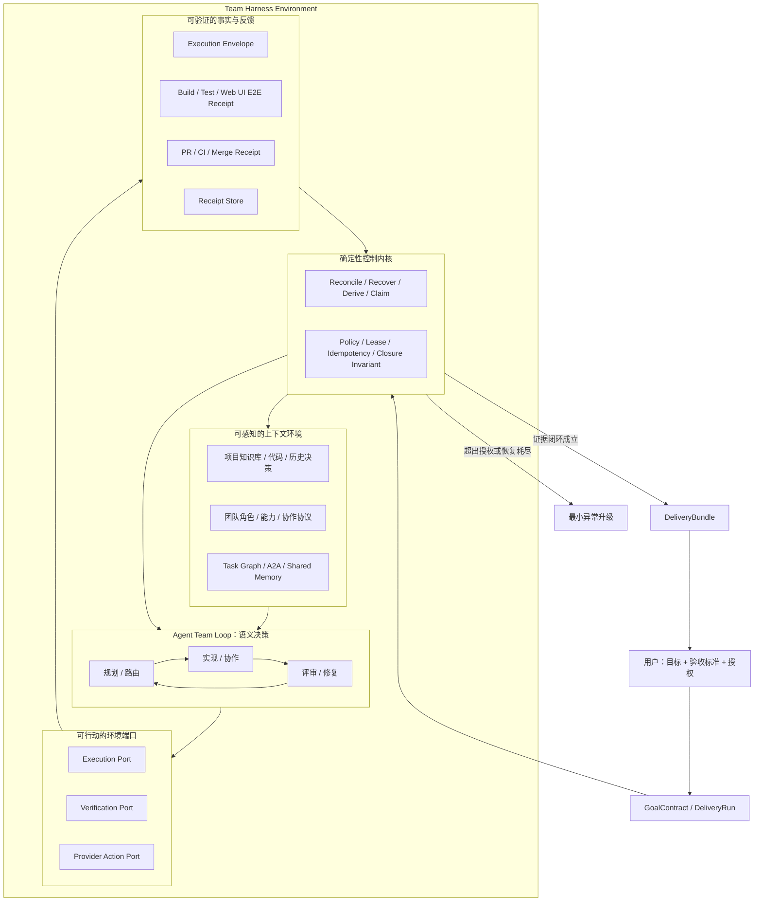

# Team Harness 自主交付闭环技术设计

**状态**：Accepted
**日期**：2026-07-19
**关联规格**：`specs/autonomous-delivery-loop/`

## 决策

系统的核心不是增加一个更强的“多 Agent 调度器”，而是构建一个能支撑团队自身 Loop 的 **Team Harness Environment**。

单 Agent Harness 为 Agent 提供项目上下文、工具、工作目录和执行反馈，使 Agent 能完成“观察—决策—行动—验证”的局部循环；Team Harness 则为整个团队提供共享目标、项目知识、团队关系、任务图、交接协议、运行事实、质量证据和外部系统回执，使团队能完成“观察—路由—执行—评审—修复—交付”的协作循环。

`AutonomousDeliverySupervisor` 是 Team Harness 内部的确定性 reconcile 内核，而不是系统大脑。它对外隐藏跨阶段状态机、并发 claim、恢复、重试、Provider 副作用和最终收口，但不代替 Agent 做需求理解、方案设计和实现判断。

不新增 “Boss Agent”。Coordinator/Leader Agent 负责理解目标、拆解与语义路由；系统 Supervisor 负责确定性推进和完成判定。

## 架构



## Team Harness 的责任边界

| 层次 | 负责什么 | 不负责什么 |
|---|---|---|
| Agent Team Loop | 理解目标、设计方案、拆解任务、实现、评审与修复 | 不自证最终完成，不直接越权操作外部系统 |
| Context Environment | 提供项目知识、团队信息、共享状态与当前可执行事实 | 不把所有上下文无差别塞进提示词 |
| Control Kernel | 对账、恢复、租约、幂等、策略门禁和完成不变量 | 不做开放式业务/技术方案判断 |
| Action Ports | 将执行、验证、GitHub 等副作用变成受控能力 | 不允许 Agent 绕过授权直接产生不可恢复副作用 |
| Evidence Plane | 保存执行信封、验证结果和 Provider 最终回执 | 不接受 Agent 自述作为权威完成事实 |

这使系统具备两个同时成立的特性：Agent 有足够环境自主形成自己的 Loop；平台又能以机械事实约束安全、恢复和最终交付。

## Skill / Tool Capability Plane

Team Harness 采用“复用能力、统一环境”的策略：

```text
SkillRuntime / ACP / MCP / Browser / Provider CLI
                    ↓ adapters
       Context Contributor + Capability Snapshot
                    ↓
       Policy / Scope / Idempotency / Receipt
                    ↓
               Agent Team Loop
```

- Skill 负责方法、领域知识和工作流；平台不复制 Skill 正文或重新定义其步骤。
- ACP/MCP/runtime 注册结果拥有“工具是否可调用”的事实；Prompt 中声明的工具名称不构成能力。
- Browser/Playwright 负责真实 Web UI 操作；Verification Port 负责编排标准、环境、Receipt 和修复预算。
- Provider 官方工具负责外部操作；Gateway 负责授权、幂等、精确对象和终态对账。
- Context Contributor 是这些能力进入某一轮 Agent 环境的统一 adapter；任何来源不得直接拼接 Prompt。

因此，平台需要建设的是可组合 Harness，不是不断扩大的私有工具箱。

## 为什么现有 Autonomy Guard 不够

现有 guard 从 Task、Envelope 和时间推导 wakeup，并使用进程内 Map 做短期去重。它适合发现局部停滞，不具备：

- 顶层交付契约；
- 跨进程的 action claim；
- attempt lease 和失败分类；
- Provider receipt；
- 跨 Review/QA/CI/Merge 的 closure invariant；
- 交付结果幂等发布。

因此 guard 的规则应逐步收进 Team Harness 的控制内核；daemon 只保留“事实变化通知 + 周期 reconcile”。

## 持久化模型

### `autonomous_delivery_run`

- `id`
- `conversation_id`
- `root_task_id`
- `status`
- `goal_contract_json`
- `current_stage`
- `repair_cycle`
- `revision`（Run 级 CAS/fencing 版本）
- `escalation_code`
- `delivery_bundle_json`
- `created_at / updated_at / completed_at`

Supervisor 每次基于 `facts.observe(snapshot)` 写回状态时，必须携带该快照的 `revision`；
更新成功后原子递增版本。若等待外部事实期间 Run 已被取消、升级或由其他 worker 推进，
旧决策写回失败并重新读取当前事实，不能把终态回退为非终态。`root_task_id` 在 Task
删除时使用 `ON DELETE SET NULL`，项目删除再由 `conversation_id` 级联清理整个 Run。
对曾运行未发布 checkpoint 的数据库，不能只相信 `_schema_version` 水位；前向结构修复迁移会补建缺失表，并在关闭外键校验的单事务中重建旧 Run 表，提交前执行 `foreign_key_check`，保证已有 Run/Action 不丢失。

共享开发数据库也可能已经由 managed DeliveryRun 分支升级，而当前 daemon 仍运行 legacy Supervisor。兼容层必须按真实列和约束识别该情况：启动键使用 Conversation 级稳定幂等键，legacy 阶段只作为 `current_stage` 投影，持久状态映射到 managed lifecycle；缺失的 legacy Action/Attempt lease 表及 Receipt 归属列在 Supervisor 读取前按结构补齐。项目删除时，`a2a_delivery`、`chain_worklist`、`invocation_chain` 等分支特有投影仅在表存在时清理，不能因为可选投影缺失导致补偿回滚失败。
项目删除入口必须使用 Conversation 聚合事务：先按依赖顺序清理 Task Graph、A2A、
运行时与观测投影，再删除 Task 和 Conversation；任一未知外键阻塞时整体回滚，禁止留下
“Task 已删但项目/Run 仍存在”的部分状态。前端只有在该事务成功后才展示删除成功提示；
当前不提供无法恢复完整 Task Graph 的伪“撤销”。

### `autonomous_delivery_action`

- `id`
- `run_id`
- `kind`
- `subject_type / subject_id`
- `idempotency_key UNIQUE`
- `status`
- `not_before`
- `attempt_count`
- `max_attempts`
- `last_failure_code`
- `created_at / updated_at`

### `autonomous_delivery_attempt`

- `id`
- `action_id`
- `attempt_no`
- `status`
- `lease_owner / lease_expires_at / heartbeat_at`
- `workdir_ref / session_generation / execution_envelope_id`
- `started_at / completed_at`
- `failure_code / failure_detail`

### `autonomous_delivery_receipt`

- `id`
- `run_id / action_id / attempt_id`
- `kind`
- `external_id`
- `status`
- `payload_json`
- `idempotency_key UNIQUE`
- `observed_at`

### Acceptance Verification Receipt

`task_graph.gate_evidence.accepted` 只是候选 Proof。Supervisor 只把其中符合以下契约的 `evidence.verificationReceipt` 转换为 `verification.acceptance` Receipt：

- schemaVersion 固定为 1；
- deliveryRunId 精确绑定当前 Run；
- status 为 passed/failed；
- verifierAgentId 与 Proof actor 一致，且属于当前 QA/质量门 audience；
- method 为 web_ui_e2e、automated_test 或 manual_review；
- reportRef、tool、specRefs 可定位真实执行产物；
- acceptanceResults 与 GoalContract 验收标准逐项同构，每个 PASS 项都有独立 evidenceRefs。

当 GoalContract 要求 Web UI E2E 时，只有 Browser/Playwright 产生的 `web_ui_e2e` 回执可通过门禁。旧式 `mainTestResult: "passed"`、任务完成状态或任意 delivery evidence 都不能代替该回执。
本地 reportRef/specRefs 还必须解析到授权 projectPath 内的真实文件，避免只提交一个看似合理的路径字符串。

Verification 状态区分：

- `not_started`：尚无验证 Action，Supervisor 创建 `run_verification`；
- `pending`：验证已派发，等待结构化 Proof；
- `failed`：执行失败或回执不合法，进入有界 repair；
- `passed`：存在当前 Run 的完整 PASS Receipt；
- `not_required`：GoalContract 明确不要求该类验证。

最终 DeliveryBundle 从有效 Receipt 逐项生成 acceptanceResults，不再把同一组 Proof 引用复制给全部验收标准。

### Acceptance Review Receipt

`done` 只说明 Task Gate 接受了状态变更，不等于独立 Review PASS。要求评审时，
Supervisor 只接受当前 TeamPack 质量门负责人提交的 `evidence.reviewReceipt`：

- 精确绑定当前 DeliveryRun；
- Proof actor 与 reviewerAgentId 一致，且 reviewerAgentId 属于 review gate audience；
- PASS 有摘要和 evidenceRefs；
- 没有未解决的 blocking/important finding。

合法回执持久化为 `review.acceptance` Receipt；无回执创建独立 `request_review`，
失败或非法回执进入有界 `repair_review`。

### 重启恢复

服务启动时立即扫描所有非终态 DeliveryRun，并在周期对账之前先执行一次 reconcile。
运行中 Attempt 的 lease 过期后会被持久化为 `abandoned`；恢复过程复用原 Action 的
idempotency key，在剩余预算内创建新 Attempt。恢复不依赖进程内 Map，也不会创建第二个
逻辑 Action。

长任务执行期间，Supervisor 按 lease 的固定分数周期刷新 `heartbeat_at` 和
`lease_expires_at`。Attempt 完成或失败时，Repository 还会校验它仍是 Action 的当前
`attempt_no`；已被回收的旧进程即使迟到返回，也无法覆盖新 Attempt 或追加 Receipt。

## 一致性规则

1. Action 推导是纯函数；副作用执行前必须先持久化。
2. 同一 `idempotency_key` 永远只对应一个逻辑 Action。
3. claim 使用条件更新：只有 `ready/retry_wait` 且 `not_before <= now` 的 Action 可进入 `claimed`。
4. lease 过期只意味着 Attempt 可被回收，不意味着外部动作未发生；回收前必须先向 Adapter reconcile Receipt。
5. Provider adapter 必须先查后写，并使用 run/action 标记作为外部幂等键。
6. 所有阶段转换由 Receipt + Closure Policy 推导，UI/Agent 不直接写 Run 终态。
7. Review/Verification gate 通过后先持久化 DeliveryBundle，再执行发布动作；发布 Receipt
   与 Attempt 完成在同一事务内提交，成功后才把 Run 置为 completed。完成页通过持久化
   API 轮询该事实，不在事务提交前广播临时 socket 事件，避免崩溃窗口造成重复通知。
8. repair Action 的 retry 复用同一 repair cycle；只有 Action 成功但失败事实仍存在时才递增
   cycle。Action 自身失败直接升级。

## Multica 对照

Multica 的 `Issue -> Task Queue -> Daemon -> AI Tool` 分层证明了“协作对象”和“一次执行”必须分离；其 queued/dispatched/running/terminal、claim recovery、heartbeat、有限重试、workdir/session 分离恢复将作为 Attempt 层基线。

我们的差异：

- DeliveryRun 跨越多次 Task/Attempt，对最终交付而非单次 Agent 执行负责。
- Squad/Coordinator 只做路由，不拥有终态。
- Review、Web E2E、Provider 和 Delivery 都形成 Receipt。
- 默认由系统自动 repair/retry，只有策略外异常才回到用户。

## 安全

- GoalContract 明确预授权动作；未授权动作不得推断为允许。
- GitHub adapter 使用 argv 调用，不拼接 shell 字符串。
- 仓库、remote、目标分支必须命中 allowlist。
- 自动合并前重新读取 HEAD、CI、Review 和 branch protection 状态。
- 高风险动作保留完整 Proof/Receipt。

## 迁移

1. 先增加 Run/Action/Attempt/Receipt 与纯 reducer，不改变旧路径。
2. 新建项目可选择“自主交付”，由 Supervisor 驱动。
3. 将 autonomy guard 的 stale/closure 规则迁入 reducer。
4. 将直接 UI/daemon 推进改为触发 `advance()`。
5. 完成 E2E 后，默认新建项目使用自主交付；旧会话保持兼容。

## 端到端验证接缝

发布级 E2E 保留整条生产控制链，只在 `HarnessRuntimePort` 替换不可控的外部
LLM/ACP 执行。测试仍真实经过：

```text
Web UI 创建 GoalContract
  → AutonomousDeliverySupervisor
  → RepositoryHarnessPlanner / Context Manager
  → HarnessCoordinator
  → 确定性 Agent Adapter
  → task_update_status / Review Receipt
  → Browser/Playwright Web UI 验收
  → Verification Receipt
  → repair / lease recovery / startup reconcile
  → Closure Invariant / DeliveryBundle / Web UI
```

该接缝的边界是“Agent 如何决定并调用工具”，不是“系统是否完成”。测试适配器不得直接更新
DeliveryRun、Action、Attempt、Receipt 或最终 Bundle；这些事实仍由生产 Repository、Task Tool
和 Closure Policy 生成。测试控制端只负责把真实浏览器观察转换为 Agent 本应提交的结构化验证回执。

为验证跨进程恢复，Supervisor 的 attempt lease 支持通过
`AUTONOMOUS_DELIVERY_LEASE_MS` 调整；生产默认仍为 60 秒。测试在验证执行中终止进程，
待 lease 过期后重新启动服务，startup reconcile 必须将原 Attempt 标记为 abandoned，
复用同一 Action 并创建下一次 Attempt。

浏览器黑盒链路覆盖 `repair_verification` 执行中的真实进程终止与恢复；Repository +
Supervisor 的持久化进程边界测试另外按表驱动覆盖 `executing/advance_tasks`、
`verifying/run_verification`、`integrating/integrate_change` 三个阶段，统一验证旧 Attempt
被回收、逻辑 Action 不重复、下一 Attempt 从剩余预算继续。

`repair_cycle` 按失败回执推进，而不是按 reconcile 次数推进。若当前 cycle 对应的
`repair_review` / `repair_verification` Action 仍处于 ready、claimed、running 或 retry_wait，
Policy 必须复用原 idempotency key；只有该 Action 已成功结束且最新事实仍为失败时，
才允许进入下一 cycle。这样周期对账和进程重启不会误耗修复预算。

测试专用适配器与控制端点受双重门禁保护：`NODE_ENV !== production` 且
`AUTONOMOUS_DELIVERY_E2E_DRIVER=1`。生产环境无论变量如何设置都不得启用。

## 业界参考

- Multica: https://multica.ai/docs/how-multica-works
- Multica Tasks: https://multica.ai/docs/tasks
- Multica Squads: https://multica.ai/docs/squads
- OpenAI Symphony: https://openai.com/index/open-source-codex-orchestration-symphony/
- OpenAI Harness Engineering: https://openai.com/index/harness-engineering/
- Anthropic Long-running Harness: https://www.anthropic.com/engineering/effective-harnesses-for-long-running-agents
- Anthropic Harness Design: https://www.anthropic.com/engineering/harness-design-long-running-apps
