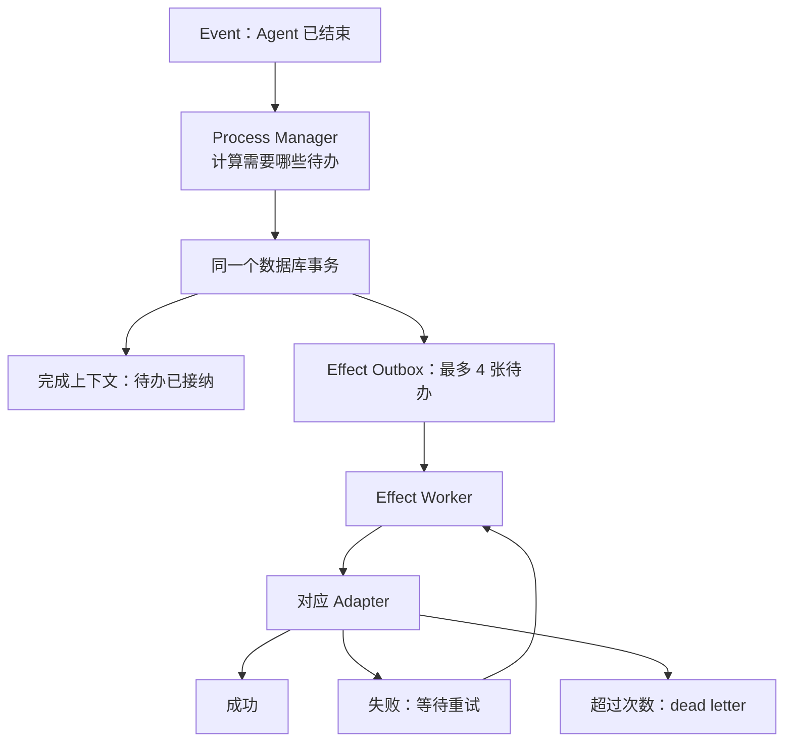
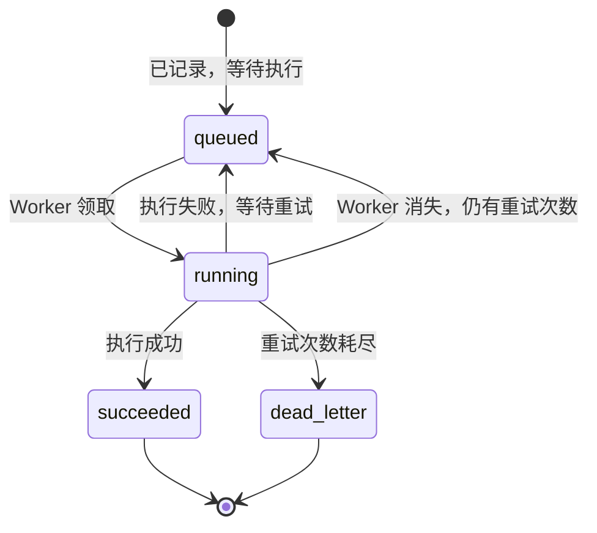

# Durable Effect Outbox：让平台决定的事情最终真的做完

**状态**：已实施

**日期**：2026-07-25

**一句话说明**：平台先把“接下来必须做的事”可靠地记下来，再由后台按顺序执行；失败可以重试，
服务重启可以继续。

上位设计：[`platform-runtime-event-model.md`](platform-runtime-event-model.md)

历史实施契约：[`../../archive/specs/durable-effect-outbox/spec.md`](../../archive/specs/durable-effect-outbox/spec.md)

阅读建议：

- 只想知道“改造干了什么”：读第 1～8 节和第 18 节；
- 需要接入或维护代码：再读第 9～17 节；
- 只想定位实现：直接看第 19 节。

---

## 1. 这次到底改了什么

一个 Agent 执行结束，并不代表平台的工作已经结束。

平台通常还要：

1. 从项目文件同步任务状态；
2. 记录 Agent 是否正确退出；
3. 必要时发起质量评估；
4. 更新团队日志；
5. 解析 Agent 回复中的交接要求；
6. 通知协作系统这个 Agent 已经结束。

以前，daemon 收到“Agent 已结束”后，会直接依次调用这些功能：

```text
Agent 结束
  → 同步任务
  → 写证明
  → 发起评估
  → 更新日志
  → 处理回复中的交接
  → 处理 Agent done
```

这条链只要在中间崩溃，就会产生一个很难回答的问题：

> 前面哪些事情已经做了，后面哪些还没做，系统重启后应该从哪里继续？

现在改成：

```text
Agent 结束
  → 一次性写入一组“待办事项”
  → 数据库提交
  → 后台 Worker 按顺序执行
  → 失败自动重试
  → 服务重启后继续
```

这组不会因进程退出而丢失的待办事项，就是 Durable Effect Outbox。

---

## 2. 为什么不能只在代码里依次调用

假设平台需要执行三步：

```text
A. 更新任务
B. 创建评估
C. 把工作交给下一个 Agent
```

### 情况一：执行完 A 后进程退出

如果没有持久待办，重启后系统不知道：

- A 是否成功；
- 是否应该再次执行 A；
- B、C 是否仍然需要执行。

### 情况二：外部动作成功，但“成功记录”没写下来

例如文件已经写入，进程却在更新数据库前退出。

系统重启后只能再次尝试，所以外部动作必须能够接受重复调用。否则，所谓“自动重试”只会制造
重复数据。

### 情况三：状态写了一半

例如 A2A 交接中：

```text
worklist 已经标为 dispatching
→ 进程退出
→ Agent Inbox 还没有写入
```

数据库看起来像“已经派发”，实际上没有任何 Agent 收到任务。后续重试又可能因为状态不再是
queued 而跳过它，任务就永久卡住。

Outbox 的目的不是让进程永远不崩溃，而是让系统在这些位置崩溃后仍然知道如何继续。

---

## 3. 只需要理解四个对象

### 3.1 Event：已经发生的事情

例如：

```text
runtime.invocation.terminated
```

意思是“这次 Agent 执行已经结束”。

Event 是事实或由事实派生出的协调信号。它描述过去。

### 3.2 Effect：接下来必须做的事情

例如：

```text
runtime.task_sync
runtime.closure_evaluation
```

Effect 不是事实。它是一张持久待办单，描述未来要执行的动作。

### 3.3 Worker：执行待办的人

Worker 定期从数据库领取可以执行的 Effect：

- 成功：标记完成；
- 失败：稍后重试；
- 服务退出：下次启动继续；
- 多次失败：停止自动重试并进入 dead letter。

### 3.4 Adapter：真正完成某类动作的实现

不同 Effect 有不同 Adapter：

- task-sync Adapter 负责同步任务；
- evaluation Adapter 负责创建评估；
- TeamLog Adapter 负责更新团队日志。

Outbox 不理解这些业务。它只统一负责“记录、顺序、领取、重试和恢复”。

---

## 4. 完整执行流程



这里最重要的边界是：

> Process Manager 显示 completed，只代表需要做的事情已经可靠记下来了，不代表所有事情已经执行完。

每张待办是否真正完成，以 Outbox 中自己的状态为准。

---

## 5. Runtime completion 会生成哪些待办

Agent 结束后，平台按下面的顺序生成待办：

| 顺序 | 待办 | 作用 | 什么时候产生 |
| --- | --- | --- | --- |
| 1 | `runtime.task_sync` | 从项目文件同步任务状态 | 正常生产执行 |
| 2 | `runtime.valid_exit_proof` | 记录 Agent 没有按要求退出 | 退出检查失败时 |
| 3 | `runtime.closure_evaluation` | 创建收口质量评估 | closure 场景且退出有效 |
| 4 | `runtime.team_log` | 更新团队日志 | 正常生产执行 |

它们使用同一个顺序组：

```text
runtime-completion:<invocationId>
```

Runtime completion 不再解析自然语言 A2A。协作由 `agent.outcome.accepted` 驱动的
A2A Process Manager 独立处理，因此不属于 Runtime completion Effect lane。

评估系统自己的 held-out 执行不会生成这些生产待办，避免测试输出进入真实任务与协作链。

---

## 6. 顺序怎么保证

Outbox 使用 lane 表达“这些待办必须按顺序执行”。

可以把 lane 理解为一条局部传送带：

```text
同一 lane:

待办 1 → 待办 2 → 待办 3
```

规则很简单：

- 前一张待办还在执行或等待重试，后一张不能开始；
- 前一张成功，后一张可以开始；
- 前一张彻底失败并进入 dead letter，后一张也可以继续；
- 不同 lane 互不阻塞，可以并行。

它不是让全平台串行。只有业务上存在先后关系的动作才放在同一个 lane。

### 为什么前一步 dead letter 后还允许继续

dead letter 的意思是：

> 这个动作已经用完自动重试次数，需要人工或上层策略处理。

它不应该默认把整个平台永久锁死。是否因为某个 dead letter 阻止更大的业务完成，应由对应业务
规则决定，而不是由通用 Outbox 猜测。

---

## 7. 两种动作不能用同一种方式处理

数据库操作和外部操作有完全不同的失败条件。

### 7.1 数据库内动作：一起成功或一起失败

例如：

- 写 proof；
- 创建 evaluation；
- 更新 A2A 状态并写入 Agent Inbox。

这些动作可以和“待办已成功”放在同一个数据库事务中：

```text
开始事务
  → 执行业务写入
  → 把待办标为成功
提交事务
```

任何一步失败，全部回滚。

这种模式在代码中叫 `transactional`。

它带来的保证是：

- 看见待办成功，就一定能看见对应业务数据；
- 业务数据没提交，待办也不会被误标为成功；
- 这种 Adapter 必须同步执行，不能偷偷返回异步 Promise。

### 7.2 外部动作：允许使用同一个身份重复尝试

例如：

- 文件系统操作；
- 远程服务调用；
- 不能加入当前 SQLite 事务的动作。

数据库无法让外部世界跟着回滚，所以系统只能保证：

```text
失败或结果未知时，使用同一个幂等键再次尝试
```

这种模式叫 `idempotent`。

Adapter 必须满足至少一个条件：

1. 把 Outbox 提供的幂等键传给下游；或
2. 动作本身是收敛的，执行多次和执行一次结果相同。

例如“把文件内容更新为 X”通常可以收敛；“无条件再创建一条记录”通常不能。

### 7.3 快速判断

```text
动作是否完全属于当前 SQLite 数据库？
  ├─ 是：transactional
  └─ 否：是否支持幂等键或安全重复？
          ├─ 是：idempotent
          └─ 否：不能接入 Outbox，必须先改造下游
```

Outbox 不承诺外部世界的 exactly-once。它提供的是诚实的、可以恢复的 at-least-once。

---

## 8. A2A 为什么需要特殊处理

A2A 一次推进会同时修改很多东西：

- chain；
- worklist；
- possession/pass；
- delivery；
- Agent Inbox；
- Socket；
- 内存中的 Agent 状态；
- timer；
- 防止重复交接的 dedup 状态。

其中只有数据库内容能真正参与事务。

所以 A2A Effect 分成两部分：

### 提交前

在数据库事务内完成：

- chain/worklist/possession 更新；
- delivery 更新；
- Agent Inbox 写入；
- Outbox 成功记录。

任何一步失败，全部回滚。

### 提交后

再执行：

- Socket 通知；
- 内存状态更新；
- timer 启停；
- dedup 状态应用。

这些进程内变化会先暂存在 staging 中。数据库提交失败时，staging 被丢弃；只有提交成功后才应用。

因此不会再出现：

```text
数据库说已经 dispatching
但 Agent Inbox 中没有任务
```

真正驱动 Agent 执行的是持久化 Agent Inbox。Socket 只是实时提示和兼容投影，不是执行事实源。

---

## 9. 服务崩溃后怎样恢复

一张待办的状态只有四种：



Worker 领取待办时，会创建一次 attempt，并记录：

- 哪个 Worker 领取了它；
- 这是第几次尝试；
- 租约什么时候过期；
- 当前 attempt 的唯一 token。

长动作执行期间会续租。

如果服务退出，租约不再续期。新进程启动后发现租约过期，就会：

1. 把旧 attempt 标记为 abandoned；
2. 如果还有次数，把待办重新放回 queued；
3. 如果次数耗尽，进入 dead letter。

服务崩溃也会消耗一次尝试，避免一个总在成功记录前退出的动作无限循环。

---

## 10. 旧 Worker 为什么不能覆盖新 Worker

可能出现这样的情况：

```text
旧 Worker 卡住
→ 租约过期
→ 新 Worker 接管并开始第二次尝试
→ 旧 Worker 又突然返回
```

如果旧 Worker 还能提交结果，就可能覆盖新 Worker。

所以每次 attempt 都有唯一 token。提交成功或失败时，数据库会同时检查：

```text
待办仍是 running
领取者仍是当前 Worker
当前 attempt token 仍然匹配
```

任一条件不满足，旧 Worker 只能得到 fenced 结果，不能改变待办状态。

这就是 fencing。简单说：

> 被判定已经失去执行权的旧进程，即使晚到，也没有写入资格。

---

## 11. 超时不等于程序已经停止

JavaScript 的 `AbortSignal` 是协作取消，不是强制杀死代码。

如果超时时系统立即开始下一次尝试，旧 Adapter 可能仍在运行，于是两个 attempt 会同时操作同一个
目标。

现在的规则是：

1. 超时时发出 abort；
2. 等待 Adapter 真正返回或抛错；
3. 结算本次 attempt；
4. 之后才允许重试。

这样同一个进程中不会因为“收到取消信号但尚未停下”而产生并发执行。

---

## 12. 幂等键解决什么

每张待办默认使用：

```text
effect:<sourceEventId>:<type>:<targetKey>
```

例如同一个 Agent 结束事件，对同一个 invocation 生成同一类待办，会得到相同的键。

再次写入时：

- 键相同、内容相同：返回原来的待办；
- 键相同、内容不同：报冲突；
- 不允许用新内容偷偷覆盖旧待办。

这能阻止 Process Manager 重试时重复创建相同逻辑动作，也能及时发现“代码重试时改变了原计划”
这样的错误。

---

## 13. 数据库中保存什么

### `platform_effect_outbox`

一行代表一张逻辑待办，主要记录：

- 来源 Event；
- 待办类型和目标；
- lane 与顺序号；
- 幂等键；
- 执行输入；
- queued/running/succeeded/dead_letter 状态；
- 尝试次数、租约和最近错误；
- 创建、更新与完成时间。

### `platform_effect_attempt`

一行代表一次具体执行，主要记录：

- 属于哪张待办；
- 第几次尝试；
- 哪个 Worker 执行；
- running/succeeded/failed/abandoned；
- 开始、结束和错误。

调用者不直接维护这些表。它们是 Outbox 内部的可靠性实现和诊断事实。

---

## 14. 从旧系统怎样升级

旧 Runtime completion 使用：

```text
runtime_completion_step_receipt
```

可能出现：

```text
前两步已经完成并写了 receipt
第三步失败
整个 completion context 仍是 pending
```

如果升级时直接删除旧 receipt，系统会把已经完成的前两步重新执行。

migration 52 因此先把旧 receipt 转成只读 suppression：

```text
task-sync          → runtime.task_sync
valid-exit-proof   → runtime.valid_exit_proof
closure-evaluation → runtime.closure_evaluation
team-log           → runtime.team_log
a2a-response       → runtime.a2a_response
a2a-done           → runtime.a2a_done
```

最后两项只用于识别 migration 52 之前已经执行过的历史 receipt；对应 Effect 类型已从
生产注册表移除。旧 pending context 恢复时会跳过仍然存在的已完成待办。

新执行路径只使用 Outbox，不再写旧 receipt，也不会继续扩展 suppression 表。

---

## 15. Outbox 能保证什么，不能保证什么

### 可以保证

- 待办和调用者状态一起提交；
- 一批待办不会只写入一半；
- 同一 lane 保持顺序；
- 服务重启后可以继续；
- 执行失败可以有界重试；
- 旧 attempt 不能覆盖新 attempt；
- 数据库动作和成功记录原子提交；
- 外部动作重试时使用同一幂等身份；
- Socket 不会早于数据库提交；
- 重试耗尽后有明确 dead-letter 事实。

### 不能保证

- 不支持幂等的外部系统 exactly-once；
- Socket 一定送达；
- dead letter 自动得到业务上的正确处理；
- 所有业务都应该迁入同一个 lane；
- 用户无需关注严重且持续失败的外部系统。

Outbox 负责可靠执行机制，不替代业务决策。

---

## 16. 新增一种待办时需要回答什么

新增 Effect type 前，必须回答：

1. 它由哪个已经发生的 Event 决定？
2. 目标对象是什么，能否形成稳定 target key？
3. 它与哪些动作存在先后关系，lane 应该是什么？
4. 重启后，仅靠保存的输入能否执行？
5. 它是纯 SQLite 动作，还是外部动作？
6. 如果是外部动作，幂等键如何传给下游？
7. 超时和最大尝试次数是多少？
8. 进入 dead letter 后，后续动作能否继续？
9. 哪些 Socket、Map 或 timer 必须等提交后再更新？
10. 是否存在需要兼容的旧 receipt？

禁止：

- 先执行 I/O，再补写待办；
- 每个 Process Manager 再造一套 step receipt；
- 把待办伪装成 Event；
- 把异步函数注册成 transactional；
- 丢弃 Outbox 传入的幂等键；
- 在数据库提交前发“成功”Socket；
- 用内存 Map 作为完成事实；
- 自动无限重置重试次数。

---

## 17. 关键设计决定

### 决定一：Event 和 Effect 分开

- Event 表示已经发生的事情；
- Effect 表示接下来必须做的事情。

没有把 Effect 增加成第五类 Platform Event，因为那会混淆事实和执行意图。

### 决定二：可靠性集中在一个模块

调用者只负责写入待办，不再自己实现 step receipt、重试、lease 和恢复。

否则每个 Process Manager 都会有一套略有不同、难以统一验证的失败处理。

### 决定三：数据库动作和外部动作明确分开

没有使用一个通用 async handler 假装所有动作语义相同。

系统必须明确知道一个动作能够随 SQLite 回滚，还是只能依靠幂等重试。

### 决定四：只保证局部顺序

使用 lane 保证相关动作有序，而不是让全平台使用一条全局队列。

这样 Runtime completion 可以保证 response 先于 done，不同 Agent 的收尾仍能并行。

### 决定五：A2A 的持久部分先提交

A2A 的领域状态与 Agent Inbox 必须和待办成功记录一起提交；Socket 和进程内状态只在提交后
应用。

这样浏览器实时体验仍然保留，但不再承担“任务是否真正派发”的事实责任。

---

## 18. 最后用一个例子串起来

Agent `implementer` 完成一次执行，输出：

```text
实现已经完成。@reviewer 请审查这个改动。
```

平台执行：

```text
1. 收到 runtime.invocation.terminated
2. 从 canonical message segments 重建完整输出
3. 一次性写入：
   - task_sync
   - team_log
   - a2a_response
   - a2a_done
4. 把 completion context 标记为“待办已接纳”
5. 提交数据库
```

Worker 随后执行：

```text
task_sync 成功
→ team_log 成功
→ a2a_response 开始
```

`a2a_response` 在一个事务中：

```text
创建/推进 chain
→ 写 worklist
→ 写 possession/pass
→ 写 Agent Inbox
→ 把 a2a_response 标记成功
→ 提交
```

提交后才：

```text
更新内存状态
→ 启动 timer
→ 发 Socket
```

最后执行 `a2a_done`。

如果进程在 A2A 事务提交前退出：

- chain/worklist/Inbox 一起回滚；
- a2a_response 仍未成功；
- 服务重启后重新执行；
- 不会留下“看起来已经派发，实际没人收到”的任务。

这就是这次改造真正解决的问题。

---

## 19. 实现位置

| 内容 | 文件 |
| --- | --- |
| Outbox 主模块 | `src/server/platform-events/durable-effect-outbox.ts` |
| Outbox 行为测试 | `src/server/platform-events/durable-effect-outbox.test.ts` |
| Runtime completion 待办规划 | `src/server/platform-events/runtime-completion-effects.ts` |
| 生产 Adapter | `src/server/platform-events/runtime-completion-effect-adapters.ts` |
| Runtime completion Process Manager | `src/server/platform-events/runtime-completion-process-manager.ts` |
| Worker 接线 | `src/server/platform-events/runtime-worker.ts` |
| A2A 原子聚合与 Inbox 提交 | `src/server/a2a/collaboration.ts`、`src/server/a2a/outcome-process-manager.ts` |
| 数据表与 migration 52 | `src/server/db/schema.ts`、`src/server/db/migrate.ts` |
| 历史实施契约 | `docs/archive/specs/durable-effect-outbox/` |

---

## 20. 仍需继续建设的部分

- dead letter 数量和最老 queued 时间的运维告警；
- source Event → Effect → Attempt 的观测下钻；
- 未注册 Effect type 的健康检查；
- 第二个非 Runtime-completion 采用者，用于继续验证通用性；
- 真正远程 Adapter 的统一幂等与对账规则。
