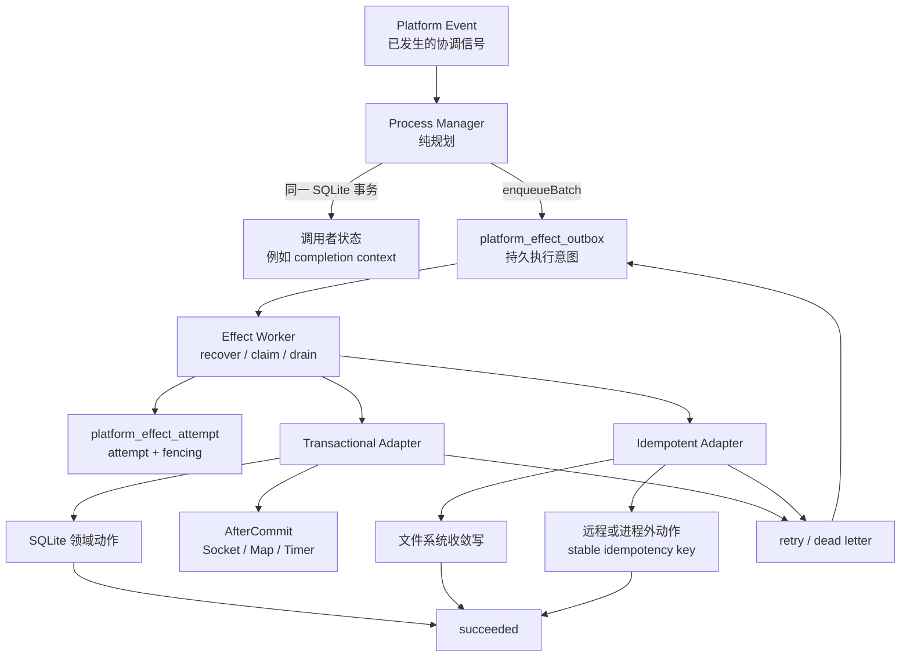
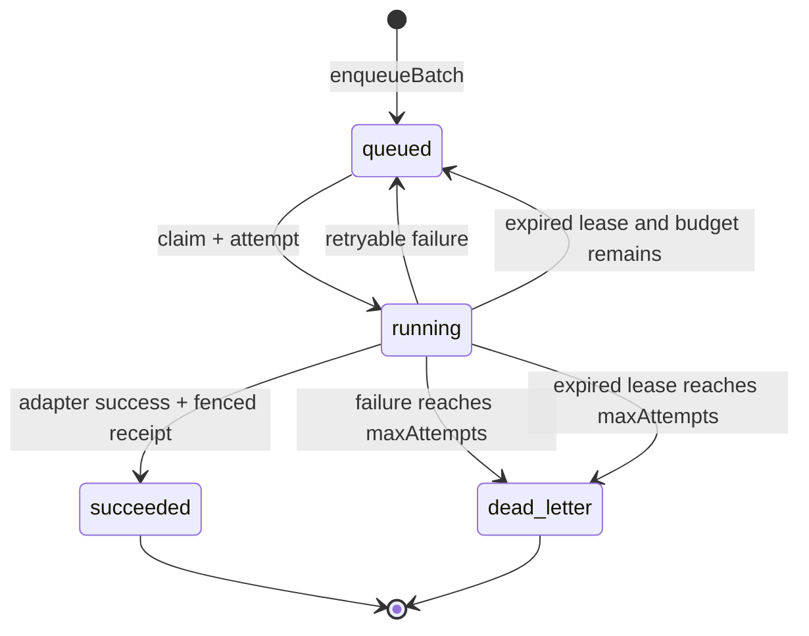
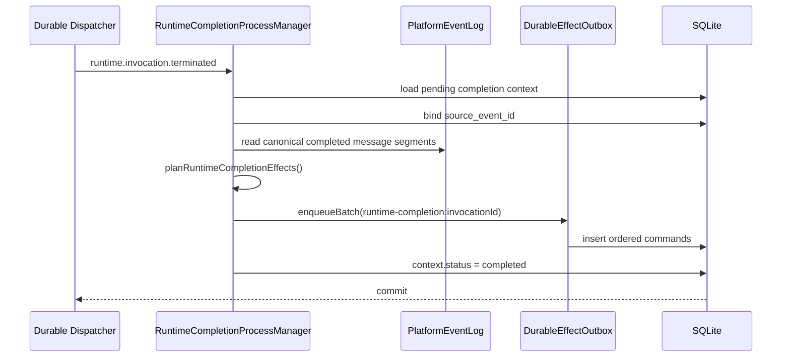

# Durable Effect Outbox 整体技术设计

**状态**：Accepted / Implemented

**日期**：2026-07-25

**权威范围**：Process Manager 产生的持久副作用意图、执行语义、顺序、恢复与迁移

**首个采用者**：Runtime completion

**上位设计**：[`platform-runtime-event-model.md`](platform-runtime-event-model.md)

**历史实施契约**：[`../../archive/specs/durable-effect-outbox/spec.md`](../../archive/specs/durable-effect-outbox/spec.md)

---

## 1. 决策摘要

平台在 Durable Dispatcher 与真实 I/O 之间增加一个通用 **Durable Effect Outbox** 深模块。

Dispatcher 只负责把已经发生的 `PlatformEvent` 至少一次交给 handler；Process Manager
负责从事实推导“接下来应该做什么”；Effect Outbox 负责把这些执行意图原子接纳、排序、
执行、重试、恢复并形成完成事实。

核心链路是：

```text
Platform Event
  → Process Manager：纯规划 Effect Commands
  → 同一 SQLite 事务：领域状态 + Effect batch
  → Effect Worker
  → Effect Adapter
  → succeeded / retry / dead letter
```

关键决策：

1. Effect Command 是**持久执行意图**，不是第五类 Platform Event，也不是领域事实。
2. Process Manager 的成功边界是“Effect Commands 已原子接纳”，不是“副作用已经执行”。
3. 同一 lane 严格有序，不同 lane 可并行。
4. SQLite 内动作使用 `transactional` 语义；不可加入 SQLite 的动作使用 `idempotent` 语义。
5. 系统对外部动作只承诺 at-least-once；不虚构 exactly-once。
6. attempt、lease、fencing、退避、dead letter 与恢复全部隐藏在 Outbox 实现内部。
7. Socket、进程内 Map 和 timer 不是 durable 事实，只能在 commit 后 best-effort 更新。

---

## 2. 为什么需要这一层

### 2.1 Dispatcher 的可靠性止于 handler interface

Durable Dispatcher 可以证明：

```text
PlatformEvent × handler → 至少一次进入 handler
```

它不能证明：

```text
handler 决定的文件写入 / Socket / 远程调用 / 多表更新 → 最终可靠完成
```

如果每个 Process Manager 自己维护 step receipt，会重复实现顺序、重试和恢复，而且仍无法
解决“外部动作成功、SQLite receipt 尚未提交时进程退出”的窗口。

### 2.2 本地事务不能包住外部世界

下面的写法只在动作完全属于同一 SQLite connection 时成立：

```text
BEGIN
  执行动作
  写 success receipt
COMMIT
```

文件系统、Socket、其他进程和远程服务不会跟随 SQLite 回滚。如果把它们放进事务：

- 外部动作成功、receipt 回滚：重试会再次调用外部动作；
- Socket 已发出、领域状态回滚：观察者看到未提交事实；
- 捕获错误后仍提交 receipt：瞬时故障被永久误判为成功；
- 不捕获错误但没有稳定幂等键：重试可能制造重复结果。

Outbox 不消灭这些物理限制，而是把限制变成显式契约。

### 2.3 删除测试

如果删除 Durable Effect Outbox，以下复杂度会重新散落到每个调用者：

- batch 原子接纳；
- stable idempotency key 与内容漂移检测；
- lane 序号与前驱阻塞；
- claim、attempt、lease、heartbeat 和 fencing；
- timeout 后等待执行真正释放；
- retry/backoff/max-attempt/dead-letter；
- transactional 与 idempotent 两类完成语义；
- startup recovery 与陈旧 worker 隔离。

因此该模块具有足够的 Depth：调用者学习少量 interface，却复用完整可靠性实现。

---

## 3. 语义分类

| 对象 | 表达什么 | 是否已经发生 | 事实 owner | 可靠性 owner |
| --- | --- | --- | --- | --- |
| Platform Event | 已提交事实派生出的协调信号 | 是 | 对应领域或 Platform Runtime | Durable Dispatcher |
| Effect Command | 根据事实推导出的待执行意图 | 否 | 发出它的 Process Manager | Durable Effect Outbox |
| Domain Row | Task/A2A/Evaluation 等当前权威状态 | 是 | 对应领域模块 | 领域事务 |
| Effect Attempt | 某 worker 对 command 的一次执行尝试 | 是 | Effect Outbox | Effect Outbox |
| Effect success | command 已按所选语义完成 | 是 | Effect Outbox | Effect Outbox |
| Socket notification | 已提交事实的实时提示 | 不作为权威事实 | Projection/Adapter | best-effort |

不允许把 Effect Command 放入 `PlatformEvent` 四分类。事件表示“发生了什么”，Effect 表示
“必须尝试做什么”；混合二者会污染事件 owner、回放语义和诊断口径。

---

## 4. 目标与非目标

### 4.1 目标

- 调用者状态与 Effect batch 同事务提交；
- 相同请求幂等返回，内容漂移稳定冲突；
- lane 内严格有序、跨 lane 并行；
- 进程退出后安全恢复；
- 旧 attempt 不能覆盖新 attempt；
- retry 有界，到限 dead-letter 并释放后序；
- 数据库动作与 success receipt 原子；
- 外部动作携带稳定幂等键安全重试；
- 实时通知不早于 durable commit；
- 所有可靠性知识集中在一个模块。

### 4.2 非目标

- 不对不支持幂等的外部系统承诺 exactly-once；
- 不把 Socket 变成持久消息系统；
- 不替代 Task、A2A、Review、Delivery 或 Evaluation 的事实 owner；
- 不把所有已有 worker/queue 强制迁入本模块；
- 不让用户主界面直接暴露 lease、attempt、lane 等实现概念；
- 不在 payload 中保存密钥、认证头或完整敏感工具输入。

---

## 5. 总体架构



### 5.1 模块关系

| 模块 | 责任 | 不承担 |
| --- | --- | --- |
| Process Manager | 从事件和领域状态纯规划 Effect | 不执行 I/O，不维护 retry |
| Durable Effect Outbox | 接纳、排序、claim、attempt、恢复和完成判定 | 不理解领域业务 |
| Effect Adapter | 把某个 Effect type 翻译成具体动作 | 不自行实现队列 |
| Effect Worker | 在 runtime tick 中驱动 Outbox | 不复制 Outbox 状态机 |
| Domain Module | 维护领域事实与业务不变量 | 不拥有通用 Effect 调度 |

---

## 6. 深模块 interface

生产者只需要一个主要方法：

```ts
enqueueBatch({
  sourceEventId,
  laneKey,
  effects: [
    { type, targetKey, payload, idempotencyKey? },
  ],
}): DurableEffect[]
```

执行端只需要三个操作：

```ts
register(registration): void
recover(): RecoveryResult
drain(limit?): Promise<DrainResult>
```

调用者必须知道的 interface 契约只有：

- `sourceEventId` 必须对应持久 Platform Event；
- `laneKey` 定义局部顺序域；
- `type + targetKey` 必须稳定；
- 自定义 `idempotencyKey` 必须在业务语义上稳定；
- Adapter 必须明确选择 `transactional` 或 `idempotent`；
- `transactional` Adapter 必须同步；
- `idempotent` Adapter 必须传播幂等键或证明动作可安全重复。

调用者不需要知道：

- SQL 表和索引；
- lane sequence 如何分配；
- attempt id 如何生成；
- worker 如何 claim；
- lease 如何续期和恢复；
- fencing 条件；
- retry 退避算法；
- dead-letter 转换；
- timeout 的协调取消实现。

这部分隐藏实现产生 Leverage 和 Locality，也是该 seam 存在的主要价值。

---

## 7. Effect Command 契约

### 7.1 稳定身份

默认幂等键：

```text
effect:<sourceEventId>:<type>:<targetKey>
```

稳定键绑定以下内容：

- source event；
- effect type；
- target；
- lane；
- canonical JSON payload。

同一 key 再次接纳：

- 内容完全一致：返回原 command；
- 任一绑定内容不同：抛出 `durable_effect_idempotency_conflict`；
- 不允许“最后一次写入获胜”覆盖原意图。

### 7.2 Canonical payload

对象 key 按稳定顺序序列化，数组顺序保留。幂等比较基于 canonical JSON，而不是调用者对象
的属性插入顺序。

payload 是执行所需的最小快照：

- 必须足够让 Adapter 在重启后独立执行；
- 不得依赖原 Process Manager 的进程内闭包；
- 不得包含秘密；
- 不应复制可由稳定 id 查询的大体量领域对象。

### 7.3 原子 batch

`enqueueBatch()` 使用 SQLite immediate transaction。Process Manager 可以在外层事务中：

```text
绑定 source event
→ 规划 commands
→ enqueueBatch
→ 标记 context 已接纳
```

任一步失败，状态和整批 commands 一起回滚。不存在“context 已完成但 commands 未入队”或
“只入队半批”的中间状态。

---

## 8. 持久化模型

### 8.1 `platform_effect_outbox`

| 字段组 | 字段 | 语义 |
| --- | --- | --- |
| 身份 | `id` | Effect Command ID |
| 来源 | `source_event_id` | 推导该意图的 Platform Event |
| 路由 | `effect_type`, `target_key` | Adapter 类型与稳定目标 |
| 顺序 | `lane_key`, `lane_sequence` | 局部严格顺序 |
| 幂等 | `idempotency_key` | 逻辑 command 唯一键 |
| 输入 | `payload` | canonical JSON |
| 状态 | `status` | queued/running/succeeded/dead_letter |
| 重试 | `attempt_count`, `next_attempt_at`, `last_error` | 有界重试事实 |
| 租约 | `lease_owner`, `lease_expires_at`, `current_attempt_id` | claim 与 fencing |
| 时间 | `created_at`, `updated_at`, `completed_at` | 生命周期 |

关键约束：

- `idempotency_key UNIQUE`；
- `(lane_key, lane_sequence) UNIQUE`；
- source event 删除时 command 级联删除；
- attempt count 非负、lane sequence 大于零；
- status 只允许四个持久状态。

### 8.2 `platform_effect_attempt`

| 字段 | 语义 |
| --- | --- |
| `id` | fencing token，同时是 attempt 身份 |
| `effect_id` | 所属 command |
| `attempt_no` | command 内单调递增序号 |
| `worker_id` | claim worker |
| `status` | running/succeeded/failed/abandoned |
| `started_at`, `finished_at` | 执行窗口 |
| `error` | 截断后的失败摘要 |

`(effect_id, attempt_no)` 唯一。Attempt 是诊断与 fencing 事实，不是调用者需要操作的对象。

### 8.3 `runtime_completion_legacy_effect_suppression`

这是 migration 52 的只读兼容桥：

- 将 v51 已提交的 completion step receipt 映射成对应 effect type；
- pending completion 重放时跳过已经完成的旧步骤；
- 新执行路径不向该表写入；
- 它不替代 Outbox，也不是新的 receipt 模型。

---

## 9. 生命周期与顺序



### 9.1 lane 规则

一个 command 可被 claim，当且仅当：

- status 为 `queued`；
- `next_attempt_at <= now`；
- 对应 Adapter 已注册；
- 同 lane 中不存在 sequence 更小且状态不是 `succeeded/dead_letter` 的前驱。

因此：

- 前驱 retry 会阻塞后继；
- 前驱成功后后继放行；
- 前驱 dead-letter 后后继也放行，避免整条 lane 永久停摆；
- 不同 lane 没有前驱关系，可并行执行。

lane 不是全局队列，也不是领域 owner。它只表达一组 Effect 之间必须保持的执行顺序。

### 9.2 为什么 dead letter 放行后继

dead letter 表示系统已耗尽本 command 的自动执行预算，不表示后续所有动作都必须永久停止。
是否需要阻断业务完成，由上层根据 dead-letter 事实制定策略；Outbox 自身不把一个失败 command
变成无限期全局锁。

---

## 10. 两种执行语义

### 10.1 Transactional Adapter

适用于可在当前 SQLite connection 内同步完成的动作。

```text
BEGIN IMMEDIATE
  校验 effect + worker + attempt token 仍有效
  Adapter 执行领域写入
  effect → succeeded
  attempt → succeeded
COMMIT
AfterCommit()
```

保证：

- Adapter 抛错：领域写入和 success receipt 一起回滚；
- success receipt 提交：领域写入必定已提交；
- 旧 attempt token 无法提交；
- Adapter 返回 Promise 时拒绝执行，避免把异步动作伪装成 SQLite 原子事务；
- AfterCommit 失败不会重新执行已提交的 durable 动作。

适合：

- proof append；
- evaluation admission；
- A2A chain/worklist/possession + Agent Inbox admission；
- 其他同库同步写入。

不适合：

- 文件系统；
- HTTP/RPC；
- 子进程；
- 需要等待异步回执的调用。

### 10.2 Idempotent Adapter

适用于不能加入 SQLite 事务的动作。

```text
claim
→ Adapter(effect, stable idempotencyKey, AbortSignal)
→ 外部动作
→ fenced success receipt
```

崩溃窗口始终存在：

```text
外部动作成功
→ 进程退出
→ success receipt 尚未提交
→ 恢复后再次调用 Adapter
```

所以 Adapter 必须：

1. 将 `idempotencyKey` 传给下游；或
2. 证明操作是可安全重复的收敛写入。

适合：

- TASKS.md → DB 的收敛同步；
- TeamLog materialization；
- 支持幂等键的外部 provider；
- 内容寻址或 replace-style 文件投影。

### 10.3 崩溃窗口矩阵

| 崩溃位置 | Transactional | Idempotent |
| --- | --- | --- |
| claim 后、动作前 | lease recovery 后重试 | lease recovery 后重试 |
| 动作中 | SQLite 回滚 | 下游结果未知，使用同 key 重试 |
| 动作后、receipt 前 | SQLite 回滚动作 | 可能重复调用，下游必须幂等 |
| receipt commit 后 | 已完成，不重试 | 已完成，不重试 |
| AfterCommit 中 | durable 动作已完成，通知可丢 | 不适用 |

---

## 11. Claim、lease、timeout 与 fencing

### 11.1 Claim

claim 在 immediate transaction 内完成：

1. 选择第一个到期、已注册、无未完成前驱的 queued command；
2. `attempt_count + 1`；
3. 写入 `worker_id`、`lease_expires_at`、`current_attempt_id`；
4. command 转 `running`；
5. 插入 running attempt。

条件更新确保并发 worker 只有一个获得 command。

### 11.2 Lease recovery

生产 worker 在启动首个 tick 调用 `recover()`；每次调用都会扫描过期 running command：

- attempt 标记 `abandoned`；
- 若 attempt budget 尚未耗尽，command 重新 queued；
- 若已达到 `maxAttempts`，command 直接 dead-letter；
- 过期 attempt 的错误记录为 `durable_effect_lease_expired`；
- dead-letter 前驱不再阻塞 lane。

进程崩溃同样消耗 attempt 预算，避免“每次都在 receipt 前退出”造成无限重试。

### 11.3 Heartbeat

Idempotent Adapter 执行期间按 lease 固定分数续期。续期条件包含：

- command id；
- running status；
- worker id；
- current attempt id。

任何条件不匹配都说明当前 worker 已被 fencing。

### 11.4 Timeout

timeout 触发 `AbortSignal`，但不会立即启动同 command 的下一 attempt。Worker 必须等待当前
Adapter Promise 真正 settle，再把本次 attempt 结算为失败。

这避免协作取消被误解为强制终止，进而让两个 attempt 并发操作同一外部目标。

### 11.5 Fencing

success/failure 更新都包含：

```text
effect id
+ status = running
+ lease owner = current worker
+ current attempt id = claimed token
```

旧 worker 晚到时更新行数为零，只能得到 `fenced`，不能覆盖新 attempt 的状态。

---

## 12. Runtime completion 完整采用

### 12.1 规划时序



这里 `completion context = completed` 的含义是“生产 Effect 已持久接纳”，不是六类动作都已执行。
每个动作的最终状态由 `platform_effect_outbox` 表达。

### 12.2 Effect 目录

| 顺序 | Effect | 条件 | 模式 | 完成语义 |
| --- | --- | --- | --- | --- |
| 1 | `runtime.task_sync` | production invocation | idempotent | TASKS.md 收敛同步成功 |
| 2 | `runtime.valid_exit_proof` | 有场景且退出无效 | transactional | proof 与 receipt 同事务 |
| 3 | `runtime.closure_evaluation` | closure + valid exit + task | transactional | evaluation admission 与 receipt 同事务 |
| 4 | `runtime.team_log` | production invocation | idempotent | cursor/materialization 收敛完成 |
| 5 | `runtime.a2a_response` | output 非空 | transactional | A2A 状态 + Inbox + receipt 同事务 |
| 6 | `runtime.a2a_done` | production invocation | transactional | A2A 推进状态 + receipt 同事务 |

held-out evaluation invocation 不产生任何 production Effect，避免评估输出进入真实协作链。

### 12.3 确定性规划

planner 是纯函数：

- 输入：completion context、canonical output、terminal event；
- 输出：有序 Effect descriptions；
- closure evidence cutoff 固定为 terminal event 的 `occurredAt`；
- 不读取 wall clock 决定 evidence cutoff；
- 不执行 I/O；
- 不注册 Adapter。

规划与执行分离后，协作形状由领域规则决定，可靠性由 Outbox 统一承担。

---

## 13. A2A 的事务型特殊处理

A2A 不只是单表写入。一次 response 可能同时改变：

- invocation chain；
- worklist；
- possession/pass；
- audit/task graph；
- `a2a_delivery`；
- Agent Inbox；
- Socket；
- agent state Map；
- chain/pass timer；
- ripple/rate-limit dedup state。

如果把整个 Orchestrator 当作普通 idempotent 外部调用，中途退出可能留下：

```text
worklist = dispatching
但 Inbox Command 尚未写入
```

后续重试只查 queued entry，就会永久卡住。

因此 Runtime completion 的 A2A Adapter 使用 transactional 模式：

1. SQLite 领域状态与 Agent Inbox admission 在 Outbox 事务内完成；
2. durable dispatch 必须声明 `transactionalDispatchAdmission`；
3. admission 必须同步返回 `handled + admitted`，不得返回异步 completion；
4. Socket、Map、timer、dispatch timestamp、ripple state 在 staging 中暂存；
5. SQLite 或 receipt 失败时，staged 进程态全部恢复；
6. commit 后才应用 staged state 和实时通知。

`captureDedupState()/restoreDedupState()` 把模块级 ripple/rate-limit 状态也纳入 staging，防止
失败事务污染后续合法 handoff。

这不是把 Socket 变成事务的一部分。Socket 仍可能丢失；真正的下游执行入口是同事务写入的
Agent Inbox，Scheduler 在提交后调用 Harness。

---

## 14. Worker 接线与运行顺序

Platform Event runtime worker 的一个 tick：

```text
首次 tick:
  Dispatcher.recover()
  EffectOutbox.recover()

每次 tick:
  Dispatcher.discover()
  Dispatcher.drain()
  EffectOutbox.drain()
```

顺序含义：

1. 先让事件 handler 发现事实并持久规划 Effect；
2. 再执行已经接纳的 Effect；
3. worker 重启时先恢复过期 delivery/attempt；
4. daemon 不再维护 Runtime completion 的逐步重试编排。

单次 `drain(limit)` 会并发处理已 claim 的不同 lane；同 lane 后继在前驱结算前不可 claim。

---

## 15. v51 → v52 迁移

旧模型允许：

```text
completion context = pending
task-sync receipt = committed
team-log receipt = committed
后序 step = failed
```

如果 migration 52 直接删除旧 receipt，升级后 Process Manager 会重新规划全部 Effect，导致
已经完成的 proof、TeamLog 或 A2A 步骤重放。

迁移采用 suppression bridge：

```text
runtime_completion_step_receipt.step
  task-sync          → runtime.task_sync
  valid-exit-proof   → runtime.valid_exit_proof
  closure-evaluation → runtime.closure_evaluation
  team-log           → runtime.team_log
  a2a-response       → runtime.a2a_response
  a2a-done           → runtime.a2a_done
```

流程：

1. 创建 Outbox/Attempt 表；
2. 创建 `runtime_completion_legacy_effect_suppression`；
3. 把旧 receipt 映射为 `(event_id, effect_type)`；
4. 删除旧 `runtime_completion_step_receipt`；
5. PM 对 pending context 规划时过滤 suppression；
6. 所有新完成事实只写 Outbox，不再写 suppression。

该桥只服务升级兼容，不扩展为通用双写机制。

---

## 16. 失败处理与运维

### 16.1 错误分类

| 失败 | 处理 |
| --- | --- |
| 幂等键内容漂移 | 稳定冲突，调用者修正规划 |
| 未注册 Effect type | 保持 queued，不盲目执行 |
| Adapter 抛错 | retry/backoff，达到预算后 dead-letter |
| Transactional Adapter 返回 Promise | 配置错误，回滚并重试/告警 |
| Idempotent Adapter timeout | abort + 等待释放 + retry |
| Lease expiry | abandoned；按预算 requeue/dead-letter |
| 旧 attempt 晚到 | fenced，不改变 command |
| AfterCommit 失败 | 记录告警，不重放 durable 动作 |

### 16.2 诊断查询

诊断至少需要回答：

- 某 source event 规划了哪些 Effect；
- 某 lane 当前被哪个前驱阻塞；
- command 处于 queued/running/succeeded/dead-letter 哪一态；
- 已执行多少 attempts；
- 当前 worker、lease 和 attempt token；
- 最近错误与下次尝试时间；
- 是否因 lease expiry 耗尽预算；
- 是否属于 v51 suppression。

当前模块提供 `get()` 与 `listBySourceEvent()` 作为程序内诊断入口；表可供服务端运维查询。
这些字段不直接进入用户主界面。

### 16.3 告警建议

- dead-letter 数量和增长率；
- running 且 lease 即将/已经过期；
- queued 最老年龄；
- lane 阻塞时长；
- 未注册 Effect type；
- `durable_effect_idempotency_conflict`；
- AfterCommit 连续失败。

---

## 17. 安全与数据治理

- payload 禁止密钥、Bearer token、Cookie、认证头和完整敏感工具输入；
- `last_error` 和 attempt error 截断为 1,000 字符；
- 默认不保存 stack；
- idempotency key 不应编码秘密；
- source event 外键保证项目事实删除时相关执行意图级联清理；
- Adapter 只能处理自己注册的 type；
- 外部 Adapter 必须把幂等键绑定到精确目标，不能使用模糊全局去重；
- 用户可见错误应翻译成领域 reason code，不直接展示 lease/SQL 等实现细节。

---

## 18. 新采用者接入规则

新 Process Manager 接入前必须回答：

1. source fact 是什么，`sourceEventId` 来自哪里？
2. 哪些 Effect 必须保持相对顺序，lane 如何定义？
3. `targetKey` 是否稳定且足够精确？
4. payload 是否能在重启后独立执行？
5. 动作能否完全加入当前 SQLite transaction？
6. 若不能，下游是否支持稳定幂等键或收敛写？
7. max attempts、timeout 和错误语义是什么？
8. dead-letter 后是否允许 lane 后继继续？
9. 哪些通知只能放在 AfterCommit？
10. 是否存在需要升级迁移的旧 receipt？

### 18.1 选择执行模式

```text
动作是否完全同步且只写当前 SQLite connection？
  ├─ 是 → transactional
  │       └─ Socket/Map/timer → AfterCommit
  └─ 否 → 下游是否支持稳定幂等键或安全收敛？
          ├─ 是 → idempotent
          └─ 否 → 不得注册为 durable effect；先改造下游契约
```

### 18.2 禁止的接入方式

- handler 内先执行 I/O，再补 enqueue；
- 为每个 PM 新建私有 step receipt；
- 把 Effect Command 伪装成 Platform Event；
- 把 async function 注册成 transactional；
- idempotent Adapter 丢弃传入的 idempotency key；
- 在 commit 前发出表示成功的 Socket；
- 用进程内 Map 作为完成事实；
- 遇到 dead-letter 后无限自动重置 attempt budget。

---

## 19. ADR

### ADR-001：Effect Command 不是 Platform Event

- **背景**：两者都需要持久化和异步处理，容易被误合并。
- **决策**：Event 表达已经发生的协调信号；Effect 表达待执行意图，使用独立表和 worker。
- **替代方案**：增加第五类 event。否决原因是执行意图会污染事实语义和 owner。
- **后果**：Dispatcher 与 Effect Outbox 各自拥有清晰的可靠性范围。
- **退出条件**：无。

### ADR-002：一个深模块统一可靠性

- **背景**：逐 PM step receipt 让 retry、lease 和崩溃窗口散落。
- **决策**：调用者只使用 `enqueueBatch`，Outbox 隐藏全部执行状态机。
- **替代方案**：保留每个 PM 的私有编排。否决原因是浅模块重复且难以统一验证。
- **后果**：新采用者复用同一 interface 和测试语义。
- **退出条件**：若未来出现跨数据库/跨节点规模需求，可替换实现，不扩大调用者 interface。

### ADR-003：显式区分 transactional 与 idempotent

- **背景**：SQLite 与外部系统具有不同的原子性边界。
- **决策**：Adapter 注册时必须选择执行模式；运行时拒绝 async transactional Adapter。
- **替代方案**：统一当作普通 async handler。否决原因是会隐藏崩溃窗口并制造虚假 exactly-once。
- **后果**：调用者必须诚实描述下游能力，系统才能给出正确保证。
- **退出条件**：无。

### ADR-004：lane 局部有序，dead-letter 放行

- **背景**：Runtime completion 的 response 必须先于 done，但全局串行会牺牲并发。
- **决策**：用 lane 表达局部顺序；succeeded/dead-letter 都终止前驱阻塞。
- **替代方案**：全局 FIFO 或完全无序。前者吞吐低，后者破坏业务顺序。
- **后果**：上层必须定义合理 lane，并单独处理 dead-letter 业务告警。
- **退出条件**：无。

### ADR-005：A2A durable application 使用事务 staging

- **背景**：A2A 同时修改 SQLite、Inbox、Socket、Map、timer 和 dedup state。
- **决策**：持久状态与 receipt 同事务；进程态 staging 后在 commit 后应用。
- **替代方案**：把 Orchestrator 当 idempotent 外部调用。否决原因是可能留下 dispatching 但无 Inbox。
- **后果**：Agent Inbox 是执行事实入口，Socket 只是兼容投影。
- **退出条件**：当所有客户端完全由 Inbox/Harness 驱动时，可移除兼容 Socket dispatch，
  但 staging 原则保留。

---

## 20. 不变量

1. 相同 idempotency key 永远只绑定一份 canonical command 内容。
2. Process Manager 状态与其 Effect batch 原子提交。
3. 同 lane 前驱未终结时，后继不可 claim。
4. 不同 lane 可以并行。
5. 每个 running command 恰有一个 current attempt token。
6. 旧 token 永远不能提交新 attempt 的结果。
7. timeout 不等于 handler 已终止；释放前不得启动同 command 新 attempt。
8. lease expiry 消耗 attempt budget。
9. transactional 动作与 success receipt 同事务。
10. idempotent 动作始终使用同一稳定幂等键重试。
11. Socket/Map/timer 不作为 durable success 条件。
12. dead-letter 终止 Outbox 自动重试并释放 lane 后继。
13. held-out evaluation 不产生 production Effect。
14. v51 已完成步骤升级后不得重放。
15. A2A receipt 前失败不得泄漏 DB、Inbox、Socket、timer 或 dedup 状态。

---

## 21. 当前实现与验证入口

| 关注点 | 实现/验证 |
| --- | --- |
| 深模块 | `src/server/platform-events/durable-effect-outbox.ts` |
| 深模块测试 | `src/server/platform-events/durable-effect-outbox.test.ts` |
| Runtime planner/注册 | `src/server/platform-events/runtime-completion-effects.ts` |
| Production Adapter | `src/server/platform-events/runtime-completion-effect-adapters.ts` |
| Process Manager | `src/server/platform-events/runtime-completion-process-manager.ts` |
| Worker 接线 | `src/server/platform-events/runtime-worker.ts` |
| A2A staging | `src/server/a2a/orchestrator.ts`、`src/server/a2a/dedup.ts` |
| Schema/migration | `src/server/db/schema.ts`、`src/server/db/migrate.ts` migration 52 |
| 历史规格 | `docs/archive/specs/durable-effect-outbox/` |

实现验收覆盖：

- batch 原子性与内容漂移；
- lane 顺序与跨 lane 并行；
- transactional action/receipt 原子性；
- idempotent 外部成功后 receipt 丢失重试；
- timeout 等待释放；
- lease recovery、attempt fencing 和 crash budget；
- dead-letter 放行后继；
- Runtime completion 纯规划与 held-out 隔离；
- A2A receipt 前失败的 DB/Inbox/Socket/dedup 回滚；
- v51 部分 receipt 升级 suppression；
- worker startup recovery 与执行顺序。

---

## 22. 后续演进

短期：

- 增加 dead-letter 与最老 queued age 的服务端诊断；
- 为未注册 Effect type 增加明确健康告警；
- 评估在 observability drilldown 中展示 source event → effect → attempt 关联。

中期：

- 第二个非 Runtime-completion Process Manager 接入，验证 interface 的通用性；
- 为真正远程 Adapter 建立统一 idempotency/reconcile 规范；
- 根据负载增加可配置并发上限，而不改变 lane 语义。

长期：

- 如果 SQLite 单实例吞吐成为瓶颈，可把 claim/attempt 实现替换为外部 durable queue；
- `enqueueBatch/register/recover/drain` 的语义 interface 和本文不变量保持不变；
- 迁移实现时不得把内部 lease/SQL 细节泄漏给 Process Manager。
