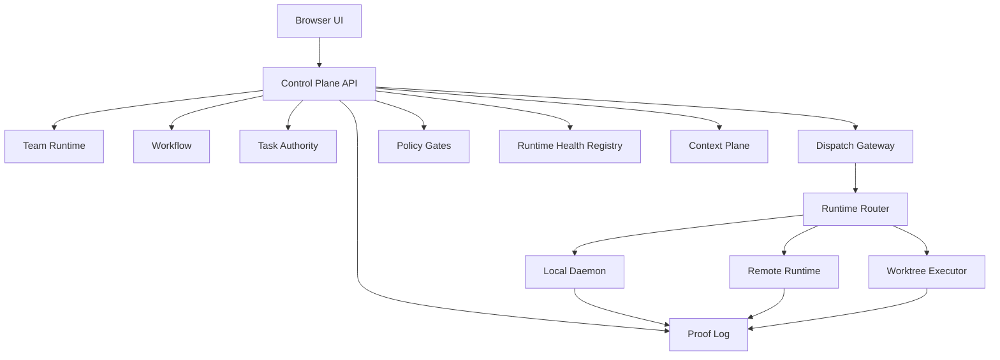

# 01 — 整体架构

## 1.1 形态与边界

Agent Task Hub 正在从前端驱动的多智能体工作台，演进为“控制平面 + 执行平面”的多实例 agent 协作系统。正式控制平面规格见 [`specs/system-control-plane/spec.md`](../../specs/system-control-plane/spec.md)。

当前实现仍保留原有分层：

| 层级 | 技术 | 职责 |
|------|------|------|
| **前端工作台** | Next.js + React | 项目切换、作战指挥室、任务详情、风险面板 |
| **状态编排层** | Zustand | UI 状态、Socket 事件、API Rehydrate |
| **团队运行契约层** | `src/lib/team-runtime` | 解析项目团队、角色资料、账号、Skill、协作规则与任务流程 |
| **应用后端层** | Next.js API + SQLite | 数据持久化、业务逻辑、Repository |
| **执行层** | Socket.io Daemon + Agent Backend | CLI 执行、会话管理、事件流 |

目标边界：

| 平面 | 职责 |
|------|------|
| **Control Plane** | 统一任务、workflow、dispatch、A2A、runtime health、policy、proof 与 context 决策 |
| **Execution Plane** | local daemon、remote runtime、worktree executor 只消费 execution envelope 并报告生命周期 |
| **UX Plane** | 发送用户意图、订阅状态、展示可解释失败，不作为跨实例投递事实源 |

关键原则：

- UI store 是运行时缓存，不是跨实例 dispatch 的事实源。
- daemon 是 executor，不应长期承担团队策略、workflow 和 A2A delivery 决策。
- browser、daemon、remote runtime 都是 runtime node，跨实例动作必须有身份、envelope、health、ACK 和 proof。
- A2A possession 负责“谁持球、谁能传球”；Control Plane 负责“能否投递、投给哪个实例、是否启动成功”。

## 1.2 运行时拓扑

目标控制平面拓扑：



当前控制面已经由服务端 Platform Harness 承担：Delivery Control Process Manager 汇总
Task、Gate、A2A、Inbox、Invocation、Context、Effect 与 Delivery 权威事实并推进流程，
纯 Delivery Decision Policy 计算确定性动作；
AgentInbox 和 Invocation Pipeline 负责可靠启动。`taskHubStore` 只提交 Human Command
并消费版本化投影，daemon 只承载 Runtime execution plane，不再存在 A2A Orchestrator
或浏览器反向确认控制事实的迁移双写。

当前运行时拓扑：

```
┌─────────────────────────────────────────────────────────────────┐
│                        Browser (前端)                           │
│  ┌───────────────────────────────────────────────────────────┐  │
│  │  Zustand Store                                            │  │
│  │  - pendingDispatches (按 agentId:conversationId 隔离)     │  │
│  │  - agentStatus / activeRunsByAgent                        │  │
│  │  - chatMessagesByConversation                             │  │
│  └───────────────────────────────────────────────────────────┘  │
└─────────────────────────────────────────────────────────────────┘
                              │ Socket.io
                              ▼
┌─────────────────────────────────────────────────────────────────┐
│                     Next.js Server                              │
│  ┌─────────────┐  ┌─────────────┐  ┌─────────────────────────┐  │
│  │ /api/state  │  │ /api/mutat. │  │ /api/socketio (Daemon)  │  │
│  └─────────────┘  └─────────────┘  └─────────────────────────┘  │
│                              │                                  │
│                              ▼                                  │
│  ┌─────────────────────────────────────────────────────────┐    │
│  │  Team Runtime Contract (src/lib/team-runtime)           │    │
│  │  - roster / profile / communication / workflow          │    │
│  │  - TeamPack roles override static preset assumptions    │    │
│  └─────────────────────────────────────────────────────────┘    │
│                              │                                  │
│                              ▼                                  │
│  ┌─────────────────────────────────────────────────────────┐    │
│  │  Daemon (src/server/daemon.ts)                          │    │
│  │  - Session 管理 (按 agentId + conversationId)            │    │
│  │  - Invocation 跟踪                                      │    │
│  │  - Account Credential 注入                              │    │
│  │  - Agent Backend 选择                                    │    │
│  └─────────────────────────────────────────────────────────┘    │
│                              │                                  │
│                              ▼                                  │
│  ┌─────────────────────────────────────────────────────────┐    │
│  │  SQLite (better-sqlite3 + SQL migrations)               │    │
│  │  - conversation / task / message                        │    │
│  │  - agent_session / invocation / event                   │    │
│  │  - account / role_card / skill                          │    │
│  └─────────────────────────────────────────────────────────┘    │
└─────────────────────────────────────────────────────────────────┘
                              │
                              ▼
┌─────────────────────────────────────────────────────────────────┐
│                    Agent Backend (执行层)                        │
│  ┌───────────────────────────────────────────────────┐         │
│  │  AcpBackend（唯一实现，ACP JSON-RPC over stdio）    │         │
│  │  → opencode acp / claude-agent-acp / codex-acp     │         │
│  └───────────────────────────────────────────────────┘         │
└─────────────────────────────────────────────────────────────────┘
```

## 1.3 核心数据流

### A) 页面初始化与 Rehydrate

1. `ClientHome.tsx` 调用 `loadFromServer()`
2. `GET /api/state` 从 SQLite 加载：
   - conversations、tasks、recentMessages
   - activeSessions、recentInvocations、skills
3. Store 映射为前端运行态，然后调用 `connectDaemon()`

### B) 用户操作与持久化

1. 用户在工作台操作（创建项目、任务、消息等）
2. WebUI Command adapter 把这次显式人工意图提交到 Socket Command 或
   `POST /api/mutations`
3. 服务端校验并执行 Command，写入 Repository → SQLite，并发布后续领域/展示事件
4. WebUI 自动事件消费者只更新展示投影，不因收到事件再次发出控制命令

### C) 任务执行链路

> 人的显式派发仍可由 WebUI 通过 `terminal:start` Command 提交；A2A、workflow、
> review gate、恢复和重试由服务端 Agent Inbox / Harness 持有。两者都会进入
> Dispatch Gateway，但服务端展示事件不会反向触发浏览器派发。

```text
人点击 / 输入命令
    │
    ▼
WebUI Command adapter
    │
    └─ terminal:start / mutation Command
              │
自动来源       │
(A2A/workflow/review/recovery)
    │          │
    ▼          ▼
Agent Inbox / Harness
    │
    ▼
Dispatch Gateway → ExecutionEnvelope → ACP Runtime
    │
    ├─ canonical Platform Events → 持久投影 / Process Manager / 后续命令
    └─ project:view / task.* / a2a.* → 项目 room → WebUI 展示投影
```

任何 dispatch 都不能在 Harness/runtime 确认前被标记为 `started`；浏览器 ACK
不构成执行事实。

### C2) Team Runtime Contract

`src/lib/team-runtime/` 是当前项目级协作内核。它不新增一张独立运行时表，而是从已有事实对象解析出当前项目的团队运行结构：

- `Conversation.team_pack_id`
- `TeamPack.roles[]`、`workflow`、`communicationMatrix`
- RoleCard、Account、Skill 绑定
- preset agents 和当前 active agent 列表

解析结果包含四个关键事实：

- `TeamRuntime.roster`：当前项目可展示、可绑定、可派发、可注入 prompt 的团队成员。
- `RuntimeAgentProfile`：单个成员的执行资料，包含账号、engine、RoleCard、Skill、TeamPack 和 roster。
- `CommunicationPolicy`：一次返回 A2A handoff 的阻止原因；`undefined` 表示允许，字符串表示用户可读的拒绝说明，不再暴露重复 predicate 或未接线 escalation resolver。
- `TeamRuntime.initialAgentId`：根据 TeamPack workflow 与当前 roster 直接派生会话的初始任务负责人；它是确定值，不再包裹单 getter policy。后续任务推进归 Task Graph / Platform Harness。

当前落地链路：

- Store 的 `getEffectiveRoster()` 与 `getAgentRuntimeProfile()` 委托给 Team Runtime Contract，store 只缓存结果，不拥有规则。
- 浏览器任务详情等执行入口直接消费 `RuntimeAgentProfile`；不保留组件级账号→engine resolver、Store 映射 facade 或缺失 Profile 时的默认 runtime。
- `dispatchToAgent()` 先解析 `RuntimeAgentProfile`，再 compose prompt 与发送 `terminal:start`；缺少可执行资料时明确中止，不静默落到错误角色。
- Invocation Planner 把 Team Runtime roster 作为 ContextManager 的必需 provider 数据；Knowledge Tier 不再保留静态 `AGENT_ROSTER + RoleCard` fallback，空 roster 也不猜测默认团队。
- `/api/state` 返回所有持久化 agent-skill 绑定，支持动态 TeamPack role。
- A2A Command guard 从 Team Runtime 读取当前 conversation roster 与 communication policy；
  Agent 交接只接受结构化 `handoff_to_agent`，`@roleId` / `@displayName` 只用于显示和检索。
- `/api/mutations` 的任务创建在没有显式负责人时读取 `TeamRuntime.initialAgentId`；为空时再使用 runtime roster 首成员。

### D) 会话隔离机制

**设计目标**：每个项目中每个 Agent 维护一个长期会话，所有对话共享上下文。

| 维度 | 隔离键 | 说明 |
|------|--------|------|
| Session (DB) | `(agent_id, task_id)` | 一个项目中一个 Agent 可有多个 session（按 task 隔离），通过 `findActiveByConversation()` 按 conversation 查询 |
| Daemon 进程锁 | `(agentId, projectId)` | 同一项目中同一 Agent 只能有一个运行进程 |
| 前端队列 | `agentId:conversationId` | 每个项目的排队消息独立，不会互相干扰 |

**Session 生命周期**：
```
项目创建 + Agent 首次派发
    → session created (status: 'active')
    → CLI 返回 cli_session_id → 回写

后续派发（聊天 / 任务）
    → 查找 active session → 复用 cli_session_id
    → CLI --resume <cliSessionId>

项目归档
    → session sealed (status: 'sealed')
```

**关键点**：
- 任务完成或取消（done/cancelled）时 **不再** seal session
- 进程退出失败时 **不再** seal session
- Session 跟随项目生命周期

### E) 队列隔离机制

**问题背景**：之前 `pendingDispatches` 按 `agentId` 做 key，导致跨项目的排队消息共享队列，dequeue 时错乱。

**解决方案**：服务端 `agent_inbox_item` 以 project + ProjectAgent 隔离、claim、
lease、重试和恢复；浏览器 `pendingDispatches["agentId:conversationId"]` 只是从
Agent Inbox 查询得到的项目展示投影，不负责出队或重试。

**前端渲染**：`GlobalChatRoom.tsx` 按 `selectedConversationId` 过滤当前项目队列，
项目切换时重新查询服务端事实。

### F) 任务文件同步链路

1. Agent 编辑 `.ath/TASKS.md`（修改状态、认领任务、上报风险）
2. `TaskFileWatcher`（chokidar）检测变更，防抖 500ms
3. `TaskFileService.readTasksMd()` 解析文件
4. DB 同步：不存在 → 创建，已存在 → 更新
5. Socket.IO 广播 `task.sync`
6. Store 更新 → UI 刷新

## 1.4 UI 信息架构

三栏工作台布局：

```
┌─────────────────────────────────────────────────────────────────┐
│                        Header                                   │
│  [项目标题]                                    [+新建] [设置]   │
├──────────┬──────────────────────────────────────┬───────────────┤
│          │                                      │               │
│  项目    │         作战指挥室                    │   Mini        │
│  列表    │  ┌─────────────────────────────────┐ │   Kanban      │
│          │  │ 项目目标 / 拆解状态              │ │               │
│  ──────  │  ├─────────────────────────────────┤ │   代办        │
│          │  │ Agent 条带 (Mario / Coder /     │ │               │
│  项目 A  │  │ Reviewer)                       │ │   ──────      │
│  项目 B  │  ├─────────────────────────────────┤ │               │
│  项目 C  │  │ 聊天区域                        │ │   风险        │
│          │  │ - 用户消息                      │ │   阻塞        │
│          │  │ - Agent 流式响应                │ │               │
│          │  │ - 工具调用事件                  │ │               │
│          │  └─────────────────────────────────┘ │               │
│          │                                      │               │
├──────────┴──────────────────────────────────────┴───────────────┤
│                     Pending Queue (按项目隔离)                   │
└─────────────────────────────────────────────────────────────────┘
```

辅助层：
- 任务详情抽屉
- 新建任务弹窗
- Agent Roster 弹窗
- 设置抽屉（账号、角色卡、Skill）

## 1.5 后端职责

### API 层

| 端点 | 方法 | 职责 |
|------|------|------|
| `/api/state` | GET | 加载全量状态 |
| `/api/mutations` | POST | 11 种浏览器协作与数据命令；不执行 Agent Tool，不写 phase 或 Session/Invocation lifecycle |
| `/api/phases` | GET/POST/DELETE | 阶段数据的唯一读写 interface |
| `/api/daemon/init` | GET | 初始化 Socket.IO Daemon |
| `/api/socketio` | WS | WebSocket 通信 |

### Repository 层

| Repository | 职责 |
|------------|------|
| `conversationRepo` | 项目/对话 CRUD |
| `taskRepo` | 任务 CRUD + 状态流转 |
| `messageRepo` | 聊天消息追加 |
| `sessionRepo` | Agent Session 生命周期 |
| `invocationRepo` | 执行记录跟踪 |
| `skillRepo` | Skill CRUD + 绑定 |

### Daemon 职责

1. **Session 查找/创建**：`findActiveByConversation(agentId, conversationId)`
2. **Invocation 跟踪**：记录每次执行的状态和 token 用量
3. **Credential 注入**：从 Account 读取 API Key 注入环境变量
4. **Backend 选择**：根据 engine 选择对应的 Agent Backend
5. **事件广播**：统一处理 session/invocation/socket 广播

## 1.6 核心业务对象

| 对象 | 说明 | 持久化 |
|------|------|--------|
| `Conversation` | 项目/战役级上下文 | SQLite |
| `Task` | 执行任务，带 conversationId、phaseId、agentId | SQLite |
| `ChatMessage` | 对话消息，支持 streaming/tool/progress | SQLite |
| `Blocker` | 风险与阻塞项（从 task 数据派生，非独立持久化表） | 运行时 |
| `Account` | 账号与执行认证 | SQLite |
| `RoleCard` | 工程型角色卡，含 CapabilityProfile | SQLite |
| `Skill` | 可复用能力模块 | SQLite |
| `TeamPack` | 团队套件，包含角色、流程、协作规则 | SQLite |
| `TeamRuntime` | 从 Conversation / TeamPack / RoleCard / Account / Skill 解析出的项目团队契约 | 派生运行结构 |
| `AgentSession` | 会话级执行上下文 | SQLite |
| `Invocation` | 单次执行记录 | SQLite |

## 1.7 架构演进主线

### A) 项目工作台化

从任务板视图演进到"项目 > 指挥室 > 风险面板"三栏工作流。

### B) SQLite 真相源

从 localStorage 主导演进到 SQLite 主导，前端 Store 变成运行时缓存。

### C) Agent Backend 抽象

统一的 Backend 接口，新增引擎只需实现接口：

```typescript
interface AgentBackend {
  execute(prompt: string, opts: ExecuteOptions): AgentRun;
}

interface AgentRun {
  events: AsyncGenerator<AgentEvent>;
  result: Promise<AgentResult>;
  kill: () => void;
}
```

### D) 会话级隔离

Session 粒度从 `(agentId, taskId)` 演进到 `(agentId, conversationId)`：
- 一个项目中一个 Agent 只有一个长期 Session
- 任务派发复用 Session，通过 prompt 注入任务上下文
- 队列使用复合 key `agentId:conversationId` 隔离

### E) Skill 系统

RoleCard（身份）+ Skill（能力）正交设计：
- SQLite 存储：skill、skill_file、agent_skill
- PromptComposer 集成：SkillLayer 注入到 system prompt
- Git 仓库导入

### F) 智能任务分发

DispatchAdvisor 基于 CapabilityProfile 进行匹配：
1. 域关键词匹配
2. 技能匹配
3. 负载感知
4. 禁止动作检查

### G) Team Runtime Contract

项目团队从固定 agent 列表演进为运行时解析模型：

1. 没有绑定 TeamPack 的项目使用 preset agents。
2. 绑定 TeamPack 的项目以 TeamPack roles 为团队事实源。
3. RoleCard、Account、Skill、Prompt、Dispatch、A2A 和 Workflow 都读取同一个 runtime 结果。
4. Daemon 和 API 不直接解释 TeamPack 规则，只接收解析后的执行资料、协作规则或任务分配结果。

## 1.8 当前状态

| 状态 | 模块 |
|------|------|
| ✅ 已完成 | 项目工作台 UI、SQLite 持久化、Agent Backend、账号模型、Skill 系统、会话隔离、队列隔离、Team Runtime Contract 基础链路 |
| ✅ 已收敛 | 设置抽屉统一管理账号、角色素材、技能与团队套件；运行时由服务端 ACP Catalog 和项目绑定解析 |
| 📋 规划中 | 安全与权限边界、渠道/provider/routing policy |

## 1.9 关联文档

- [产品愿景](../product/vision.md)
- [研发路线图](../roadmap.md)
- [规格目录](../../specs/)
- [文档导航](../README.md)
- [架构图](./07-architecture-diagrams.md)

## 1.10 Agent Session Harness 边界

平台层 harness 拥有 Agent 的逻辑连续性，底层 runtime 只提供可加载的执行会话。当前项目容器仍由 `Conversation` 承载，因此逻辑身份为 `(conversationId, agentId)`；未来拆分 Project/Conversation 时，应迁移 scope 字段而不是改变“一个项目中的一个角色只有一个 active 逻辑会话”这一约束。

```text
Project(Conversation) + Role Agent
              |
              v
Logical Agent Session  --1:N--> Invocation
              |
              | compare-and-set binding
              v
ACP Runtime Session (new once, load on later turns)
```

这条边界让调度、上下文组装和执行记录属于平台层，而 OpenCode、Claude、Codex 等 runtime 可以替换；runtime identity 不得由浏览器缓存或单次 Invocation 改写。

## 1.11 场景化上下文注入与收敛

平台层已在唯一 `ContextManager` 网关中落地场景化注入。每轮先把 trigger 解析为 `goal_intake / planning / architecture_review / execution / handoff / code_review / verification / recovery / closure / escalation`；旧 `init / iterate / wakeup` 继续兼容。RoleCard 映射为 planner、reviewer 或 worker，再按 identity、protocol、capability、situation、focus、dialog 六簇选择内容。

`ContextManager` intake 首先拒绝错项目、缺少项目标识的消息和跨项目任务。业务事实再通过 `ContextContributor` 提供轻量 Fragment；Registry 统一校验并归一化为六维 `ContextArtifact`，完成 project/global scope、visibility、freshness、去重和失败隔离。当前动作属于 focus，不再和可省略的历史 dialog 混用。任何 required Artifact 或 required Skill 被场景/预算裁掉都会 fail closed。每轮输出基于完整脱敏 manifest 的 SHA-256 `ContextSnapshot`，记录实际加载的 Artifact revision、scope、subject、source、delivery、omission、能力与约束，并随 Harness plan 和观测 Span 留证；required 失败也写 error context span。

Capability Plane 复用 Skill Runtime、ACP/MCP 实际工具目录、Browser/Playwright 和 Provider 官方适配器；Harness 只增加场景选择、权限、幂等、Receipt 与恢复，不重复实现工具执行内核。

系统唤醒从 `TaskWakeup` 经 Harness 显式携带 reason metadata，避免首次 workflow/review/test 唤醒被当成普通用户首轮。任务子树全部终态时，Autonomy Guard 根据既有 `subtask_of` 边唤醒 planner 输出 Closure Report，并用 control proof event 跨扫描周期去重。合法出口与 A2A action 检查在 MVP 阶段均为观测规则，不阻断 agent loop。

权威设计与实现契约分别见 `docs/technical/execution/context-injection-mvp.md` 和 `specs/context-manager/spec.md`。

## 1.12 团队日志读模型

群聊协作上下文采用“信封 push + 正文 pull”。DB 中的 `chat_message` 与面向协作的 `control_proof_event` 是事实源；服务端 TeamLogProjection 派生 category、audience、task/chain 引用，并在每个 active execution workdir 物化只读 `.ath/team-log.md`。

Agent prompt 只收到最多 5 条、≤150 token 的未消费 envelope。正文由 agent 按需 grep 文件；自身历史仍由 private historyLayer 提供。`agent_log_cursor` 以 `(project_id, agent_id)` 持久化消费位置，完成一轮执行时只推进到该轮 envelope 的快照末尾。

文件温区为：hot（≤50 条、≤24h、≤5KB）、warm（7 天内按日文件）、cold（DB，文件侧仅 INDEX 摘要）。文件可以随时从 DB 重建，不承担写入或状态事实源职责。
