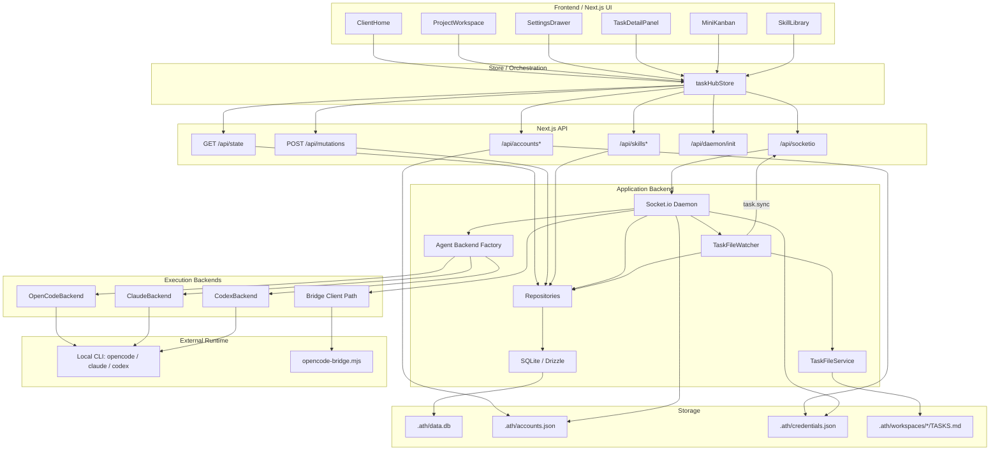
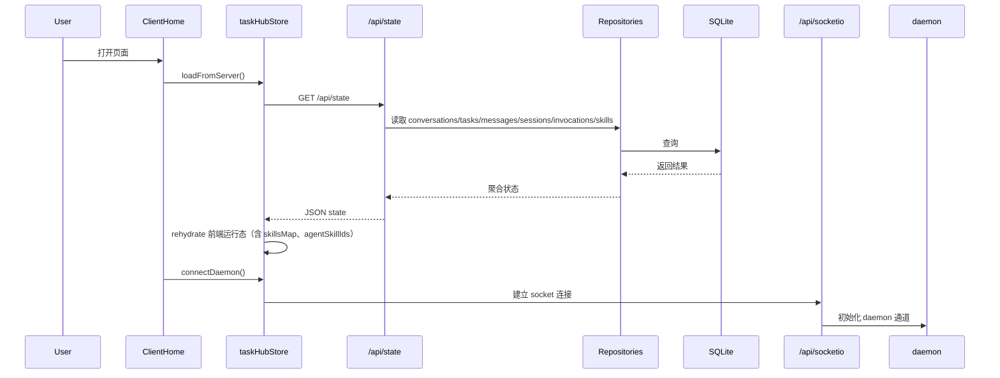
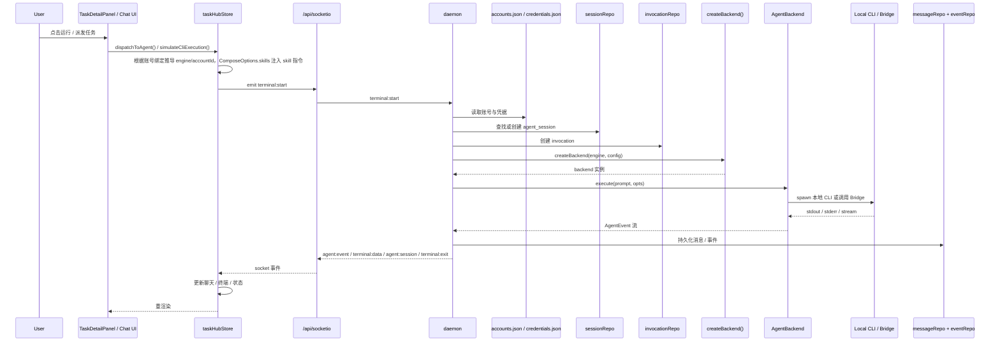
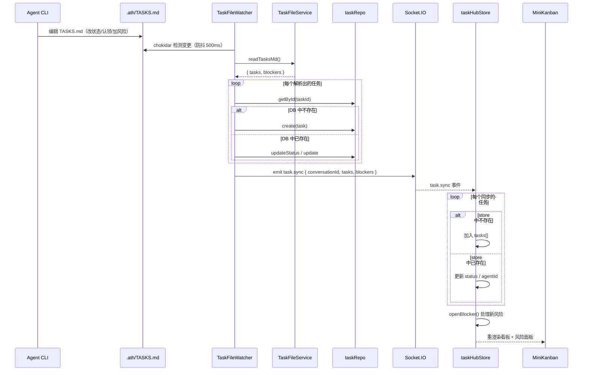
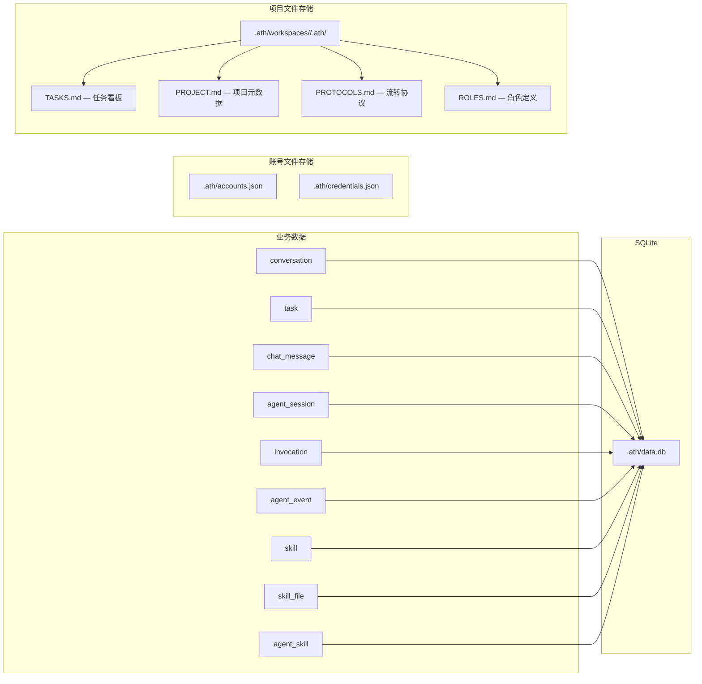

# 07 — 架构图（基于当前代码）

本页不是抽象愿景图，而是根据当前仓库中的真实代码关系整理出的架构图。

对应代码入口：

- 前端入口：`src/app/ClientHome.tsx`
- 状态编排：`src/store/taskHubStore.ts`
- API：`src/pages/api/state.ts`、`src/pages/api/mutations.ts`
- Socket / daemon：`src/pages/api/socketio.ts`、`src/server/daemon.ts`
- Agent backend：`src/server/agent/*`
- 持久化：`src/server/db/*`、`src/server/repositories/*`
- 账号与凭据：`src/server/accounts-file.ts`、`src/server/credentials.ts`

## 7.1 整体分层图

## 7.2 页面初始化与持久化链路

这条链路描述“页面打开后如何恢复状态”。

## 7.3 用户操作与执行链路

这条链路描述“用户从项目里触发一次 agent 执行”的真实路径。

## 7.3.1 任务文件同步链路

这条链路描述"Agent 编辑 TASKS.md 后看板自动刷新"的路径。

## 7.4 存储拓扑

当前项目有两类存储，不应混为一谈：

- 业务主数据：SQLite
- 账号与凭据：JSON 文件

## 7.5 当前架构要点

- 前端不是直接读 localStorage，而是先经由 `GET /api/state` rehydrate
- `taskHubStore` 是运行态编排层，不是唯一真相源
- daemon 不只是终端桥接器，还承担 session、invocation、事件落库和 backend 选择
- `opencode / claude / codex` 是当前独立 backend
- `gemini / mock` 仍不是独立 backend
- Bridge 仍可用，但不是当前前台主配置入口
- 账号与凭据当前走文件存储，不走 SQLite
- **Skill System**：正交于 RoleCard 的能力模块层，通过 SkillLayer（Layer 2）注入 systemPrompt，支持 Git 导入与 agent 绑定
- **TaskFileWatcher**：文件驱动同步管道的核心——Agent 写 MD → watcher 解析 → DB 创建/更新 → Socket 广播 → store 刷新。这是"文件即真相源"架构的关键桥梁
- **工具双写**：`task_create` / `task_update_status` 同时写 SQLite 和 TASKS.md，保证两条数据源始终一致
