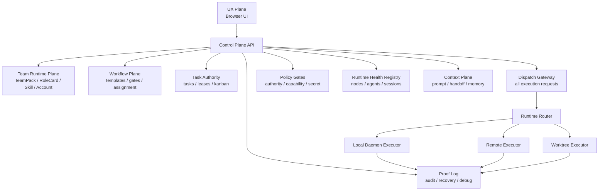

# System Control Plane

> Status: Draft for implementation
> Date: 2026-05-12
> Related sources: `team-runtime-contract/`,
> `docs/technical/execution/platform-harness-state-machine-design.md`,
> `group-chat-task-flow/`

## Problem Statement

Agent Task Hub has grown from a single UI-driven task workspace into a multi-instance agent system:

- browser UI instances create user turns and render runtime state
- the local daemon starts CLI runtimes and streams lifecycle events
- future remote runtimes may execute outside the local daemon process
- agents collaborate through A2A possession handoffs
- workflow, tasks, accounts, skills, worktrees, sessions, and runtime bindings all affect execution

The server-side Platform Harness now owns the execution loop boundaries:

- `taskHubStore` submits Human Commands and renders versioned projections only.
- Delivery Control Process Manager computes actions from authoritative owner facts.
- `A2ACollaborationRepository` owns possession, pass groups, policy admission and durable Inbox handoff.
- AgentInbox and Invocation Pipeline own reliable admission, preflight and Runtime start.
- Team Runtime remains the roster, communication policy and executable-profile resolver.

This creates system-level ambiguity:

- a dispatch can be treated as accepted before any runtime instance has acknowledged it
- a cross-instance target can be unreachable but still fail later as a generic timeout
- agent status is not a durable runtime binding fact
- socket broadcast events do not identify the exact receiving runtime node
- failure evidence is spread across UI memory, daemon logs, SQLite rows, and terminal output

The remaining scope of this spec is cross-node routing, health and proof. It must extend the existing
server-side Harness and owner boundaries, not reintroduce browser dispatch or a second A2A orchestrator.

## Design Principle

Agent Task Hub should be modeled as:

```text
Control Plane + Execution Plane
```

The control plane owns decisions and facts.

The execution plane owns side effects and reports lifecycle events.

UI, daemon, and remote runtimes are separate instances. Cross-instance actions must use explicit identity, session, envelope, health, and acknowledgement semantics.

## Goals

- Establish a single decision path for user dispatch, A2A handoff, workflow dispatch, review gates, and system-triggered execution.
- Treat browser, daemon, and remote runtimes as runtime nodes with identity and health.
- Track which runtime node currently owns each executable agent binding.
- Replace naked prompt dispatch and broadcast routing with typed execution envelopes.
- Record proof events for every critical state transition and dispatch phase.
- Keep Team Runtime as the source for roster, role, account, skill, workflow, and communication policy.
- Keep Task Authority as the source for task state and leases.
- Make runtime failures explainable before they become generic timeouts.
- Allow future federation without forcing full zero-trust mesh complexity into the first implementation.

## Non-Goals

- This spec does not require full cryptographic federation in the first implementation.
- This spec does not require external organization trust management.
- This spec does not introduce 60+ agent types or a large MCP tool registry.
- This spec does not replace the A2A possession model; it moves delivery and runtime concerns below it.
- This spec does not make the UI a trusted source of execution facts.

## Architecture Overview



## Layers

### Layer 0: Proof Log

Proof Log records critical events before and after every decision or side effect.

It is append-only for normal operation and queryable for debugging.

Required event families:

- `dispatch.requested`
- `dispatch.blocked`
- `dispatch.routed`
- `dispatch.sent`
- `dispatch.started`
- `dispatch.failed`
- `dispatch.completed`
- `runtime.heartbeat`
- `runtime.stale`
- `runtime.unreachable`
- `agent.binding.updated`
- `task.state.changed`
- `a2a.pass.requested`
- `a2a.pass.accepted`
- `a2a.pass.rejected`
- `workflow.gate.opened`
- `workflow.gate.blocked`

Proof Log is not initially required to be hash-chained or HMAC-signed. It must still carry enough correlation fields to explain behavior:

- `eventId`
- `occurredAt`
- `conversationId`
- `taskId`
- `chainId`
- `passId`
- `envelopeId`
- `nodeId`
- `agentId`
- `actorId`
- `reasonCode`
- `metadata`

### Layer 1: State Authority

State Authority owns durable facts:

- tasks and task leases
- conversations
- runtime nodes
- runtime sessions
- agent bindings
- execution envelopes
- A2A chains, possessions, passes, and handoff packets
- workflow gates and checkpoints
- worktree lifecycle state

UI stores may cache this state but must not be treated as authoritative.

### Layer 2: Policy Gates

Policy Gates decide whether an action is allowed.

Initial gates:

- `IdentityGate`: actor and source instance are known.
- `SessionGate`: cross-instance action has a valid runtime session when required.
- `AuthorityGate`: actor can request the operation.
- `TeamPolicyGate`: Team Runtime communication and workflow rules allow it.
- `PossessionGate`: only the current A2A holder can pass the ball.
- `HealthGate`: target runtime node and agent binding are reachable.
- `SecretGate`: outgoing envelope does not leak credentials or private keys.
- `BudgetGate`: chain depth, breadth, time, retry, and cost budgets are respected.
- `DedupGate`: idempotency and duplicate dispatch rules are respected.

Gate decisions must be deterministic and recorded in Proof Log.

### Layer 3: Team Runtime Plane

Team Runtime remains the canonical resolver for:

- active roster
- role cards
- account bindings
- skill bindings
- runtime profiles
- communication policy
- workflow policy
- prompt-layer team context

Control Plane consumers must use Team Runtime outputs instead of importing frontend roster assumptions.

### Layer 4: Dispatch Plane

Dispatch Gateway is the only component that turns an intent into an execution attempt.

Inputs:

- user direct dispatch
- A2A pass intent
- workflow task assignment
- review gate request
- scheduled/system trigger

Outputs:

- `blocked`
- `queued`
- `routed`
- `sent`
- `started`
- `failed`
- `completed`

No caller may mark a dispatch as started until the target executor returns a lifecycle acknowledgement.

### Layer 5: Runtime Routing Plane

Runtime Router maps an execution envelope to a target runtime node.

Routing is directed, not broadcast.

The router must know:

- target `agentId`
- target `nodeId`
- runtime kind
- endpoint or socket room
- current session
- health status
- supported capabilities

### Layer 6: Continuation Plane

Continue Gate decides whether an active run should continue, checkpoint, pause, pass, or stop.

Initial signals:

- holder turn count
- elapsed time
- output length
- repeated failed dispatches
- unresolved blockers
- budget consumption
- explicit handoff intent
- task completion signal

For A2A, this supports multi-turn holder buffers and compact handoff packets.

For workflow, this supports post-task checkpoints and gate transitions.

### Layer 7: UX Plane

UX Plane renders state and sends intents.

It must not:

- decide that a cross-instance dispatch succeeded
- infer runtime reachability from local UI status alone
- own Team Runtime resolution rules
- mutate durable task state without Control Plane confirmation

It may:

- show optimistic input state
- subscribe to proof and runtime events
- render explicit failure phases and recovery actions

## Core Domain Types

```typescript
type RuntimeNodeKind = 'browser' | 'daemon' | 'remote' | 'worktree';

type RuntimeNodeStatus = 'reachable' | 'stale' | 'unreachable' | 'suspended';

interface RuntimeNode {
  id: string;
  kind: RuntimeNodeKind;
  label: string;
  endpoint?: string;
  status: RuntimeNodeStatus;
  capabilities: string[];
  trustLevel: 'local' | 'paired' | 'verified' | 'trusted' | 'privileged';
  lastHeartbeatAt?: string;
  missedHeartbeats: number;
  createdAt: string;
  updatedAt: string;
}

type AgentBindingStatus = 'idle' | 'busy' | 'unreachable' | 'misconfigured' | 'suspended';

interface AgentBinding {
  id: string;
  conversationId: string;
  agentId: string;
  nodeId: string;
  runtimeId: string;
  status: AgentBindingStatus;
  activeEnvelopeId?: string;
  lastStartedAt?: string;
  lastFinishedAt?: string;
  lastError?: string;
  updatedAt: string;
}

type DispatchSource = 'user' | 'a2a' | 'workflow' | 'review_gate' | 'system';

type DispatchIntent =
  | 'answer'
  | 'implement'
  | 'review'
  | 'verify'
  | 'plan'
  | 'delegate';

interface ExecutionEnvelope {
  id: string;
  source: DispatchSource;
  intent: DispatchIntent;
  conversationId: string;
  taskId?: string;
  chainId?: string;
  passId?: string;
  fromNodeId: string;
  fromAgentId?: string;
  toNodeId: string;
  toAgentId: string;
  payload: {
    prompt?: string;
    handoffPacketId?: string;
    contextRefs: string[];
  };
  ttlMs: number;
  nonce: string;
  status:
    | 'drafted'
    | 'validated'
    | 'blocked'
    | 'queued'
    | 'routed'
    | 'sent'
    | 'started'
    | 'acknowledged'
    | 'rejected'
    | 'failed'
    | 'completed'
    | 'expired';
  reasonCode?: string;
  createdAt: string;
  updatedAt: string;
}
```

### ExecutionEnvelope schema compatibility

During the Platform Harness state-machine rollout, a persistent data directory may
already expose the acknowledgement-only envelope schema while a development daemon
is still running the compatibility control-plane code. The repository must inspect
the actual `execution_envelope` table contract before mutating lifecycle state:

- legacy tables keep the execution lifecycle
  `drafted → routed → sent → started → completed/failed`;
- tables with `revision` and `settled_at` use the admission lifecycle
  `drafted → validated → routed → sent → acknowledged`;
- legacy `blocked/failed` calls before acknowledgement map to `rejected` with a
  reason; execution completion/failure after acknowledgement updates binding and
  proof only and must not reopen the terminal envelope;
- autonomy recovery treats pre-acknowledgement envelopes and non-terminal
  Invocations as the active-dispatch facts, so `acknowledged` neither suppresses
  recovery forever nor causes a duplicate wakeup while execution is still running;
- daemon startup settles non-terminal Invocations left by a previous process,
  and every runtime success, runtime failure, timeout, or setup-failure
  path settles the Invocation created by that attempt;
- lifecycle methods report whether a transition was applied; daemon
  `dispatch.receipt` events are emitted only for applied transitions, so late,
  duplicate, expired, and rejected callbacks cannot become UI lifecycle truth;
- terminal Invocation outcomes are monotonic: runtime-session confirmation and
  other late callbacks cannot reverse a prior timeout or failure;
- TTL expiry must populate `settled_at` and increment `revision` on the upgraded
  schema.

This is a temporary compatibility path for development servers and persisted data
that cross the schema rollout boundary. Remove it once every supported branch uses
the acknowledgement-only repository and daemon contract.

### Invocation schema compatibility

The same development data directory can expose the managed Invocation lifecycle
before every daemon branch has adopted it. Invocation persistence must inspect the
actual table contract instead of relying on the migration watermark:

- legacy tables use `queued/running/succeeded/failed`;
- tables with `outcome`, `started_at`, `terminated_at`, and `revision` use
  `planned → starting → running → terminating/terminated`;
- legacy completion states map to terminal outcomes:
  `succeeded → completed`, ordinary `failed → failed`, cancellation failures
  `→ cancelled`, and timeout failures `→ timed_out`;
- runtime-session confirmation may enrich an active managed Invocation but must
  not settle it or reverse an existing terminal outcome;
- daemon restart settlement terminates every managed non-terminal Invocation with
  outcome `failed` and reason `process_restarted`;
- managed terminal state is monotonic and cannot be reopened by late callbacks.

This compatibility is required whenever a newer branch has already migrated the
shared development database but an older daemon branch is selected for local work.

## Dispatch Gateway Pipeline

```text
DispatchIntent created
  ↓
Normalize actor, source, conversation, task, target
  ↓
Resolve Team Runtime target profile
  ↓
Resolve AgentBinding and RuntimeNode
  ↓
Run gates in deterministic order
  ↓
Build ExecutionEnvelope
  ↓
Record proof: dispatch.routed
  ↓
RuntimeRouter sends envelope to target node
  ↓
Executor ACKs started / rejected / failed
  ↓
Update envelope, binding, task/pass state
  ↓
Record proof event
```

Gate order:

1. `IdentityGate`
2. `SessionGate`
3. `AuthorityGate`
4. `TeamPolicyGate`
5. `PossessionGate`
6. `HealthGate`
7. `SecretGate`
8. `BudgetGate`
9. `DedupGate`

Gate order matters. A missing runtime target should not be reported as an A2A timeout. A communication policy block should not be masked by breadth limits. A duplicate should not be sent to a remote node.

## Runtime Health

Runtime nodes must heartbeat independently from agent output streams.

Initial policy:

- heartbeat interval: 5 seconds
- stale threshold: 2 missed heartbeats
- unreachable threshold: 3 missed heartbeats
- suspended threshold: repeated start failures or circuit breaker policy

Health is tracked per runtime node and per agent binding.

The existing long stream watchdog remains useful for active process output but does not replace Runtime Health.

## Cross-Instance Semantics

A cross-instance action requires:

- source node identity
- target node identity
- an execution envelope
- a runtime session or local pairing
- a lifecycle acknowledgement
- proof events

Socket broadcast events are not sufficient for delivery semantics.

During migration, the system may keep compatibility events such as `a2a:dispatch`, but the Control Plane must treat them as transport adapters, not as the source of truth.

## A2A Integration

A2A Possession remains responsible for collaboration semantics:

- current holder
- pass intent
- handoff packet
- holder buffer
- pass status

System Control Plane becomes responsible for delivery semantics:

- whether the pass is allowed
- where it should route
- whether the target runtime is reachable
- whether the target acknowledged start
- why delivery failed

A2A must submit pass intents to Dispatch Gateway instead of owning the full runtime delivery chain.

## Workflow Integration

Workflow Engine submits dispatch intents to Dispatch Gateway.

Workflow gates must not start agents directly.

Task completion checkpoints should be represented as proof events and workflow gate transitions.

## Task Authority Integration

Task Authority owns task state, assignment, and leases.

Dispatch may reference a task but must not directly mutate task state without Task Authority.

When Group Chat Task Flow is enabled, Task Authority includes the Task Graph contract:

- task nodes
- task edges
- task action events
- blockers
- artifact refs
- split and merge lineage
- reopen history

The group chat UI may render task capsules and action cards, but durable task state changes must be recorded as task actions.

Task status transitions caused by runtime lifecycle events must go through Control Plane:

- start may move task to `in_progress`
- successful completion may move task to `in_review` or workflow-defined next state
- runtime failure may open blocker state
- timeout may mark lease expired or task blocked

Task graph transitions caused by A2A must also go through Control Plane:

- task-linked passes record task action events instead of changing ownership from chat text
- high-impact graph operations such as merge and cancel require confirmation
- non-owner reassignment of a running task requires confirmation before `task.claimed`
- blocked task-graph policy decisions are recorded as `task_graph.policy.blocked` proof events

- `task.handoff_requested` may create an A2A pass intent
- receiver start acknowledgement may record `task.handoff_accepted`
- blocked or rejected delivery may record a task blocker or failed handoff action
- review failure may create a reopen or corrective task action

## Context Plane Integration

Context Plane builds execution payloads from durable references:

- user turn
- task graph node and edge references
- task state
- team runtime profile
- role card
- skills
- handoff packet
- recent conversation summary
- relevant memory or knowledge refs

Execution envelopes should carry references and compact payloads, not uncontrolled full chat history.

## Security and Privacy

Initial implementation must include a lightweight `SecretGate`.

The gate should block or redact obvious sensitive material in cross-agent and cross-instance envelopes:

- API keys
- bearer tokens
- private keys
- database URLs
- GitHub tokens
- provider credentials

Future federation may extend this to a full PII pipeline and trust-level matrix.

## Migration Strategy

### Phase 1: Specification and Proof First

- Add this spec.
- Add `ProofLog` schema and repository.
- Record dispatch and runtime lifecycle events without changing all routing yet.

### Phase 2: Runtime Registry

- Add `RuntimeNodeRegistry`.
- Add `AgentBindingRegistry`.
- Register local daemon and browser client nodes.
- Track heartbeat independently from stream watchdogs.

### Phase 3: Dispatch Gateway

- Introduce `DispatchGateway`.
- Route user direct dispatch through the gateway.
- Route A2A handoff through the gateway.
- Keep compatibility transport events during migration.

### Phase 4: Executor Envelope

- Make daemon consume `ExecutionEnvelope`.
- Make future remote executors consume the same envelope shape.
- Return `started`, `failed`, and `completed` lifecycle events.

### Phase 5: Continue Gate

- Add `ContinueGateLite`.
- Use it for A2A holder buffers and workflow checkpoints.

### Phase 6: Federation-Ready Extensions

- Add runtime sessions, trust levels, circuit breaker, and stronger envelope signatures where needed.

## Current Implementation Status

- The P0 persistence layer has landed in migration version 17.
- `control_proof_event` stores append-only proof events with envelope, node, agent, conversation, task, chain, and pass correlation fields.
- `runtime_node` stores runtime node identity, kind, status, trust level, capabilities, heartbeat timestamp, and missed heartbeat count.
- `agent_binding` stores conversation-scoped agent-to-runtime-node bindings and active envelope state.
- `execution_envelope` stores normalized execution envelopes with source, intent, route, payload, TTL, nonce, lifecycle status, and reason code.
- Repository modules exist for proof events, runtime nodes, agent bindings, and execution envelopes.
- Targeted repository tests cover migration existence, heartbeat miss/recovery, binding lifecycle, envelope lifecycle/expiry, and proof timeline queries.
- A lightweight `DispatchGateway` now creates execution envelopes, records proof events, checks target runtime health, and applies a first-pass secret gate.
- The local daemon registers itself as `daemon:local`; browser clients register socket runtime nodes with 5s heartbeats.
- Runtime health scan marks non-heartbeating nodes stale after 2 missed intervals and unreachable after 3 missed intervals.
- Existing `terminal:start` dispatch now creates an envelope and proof timeline while preserving the compatibility execution path.
- Existing A2A compatibility dispatch passes chain/pass metadata into the execution envelope.
- Task Graph policy now writes proof events for blocked high-impact actions and keeps task action ids correlated through task/pass fields where available.
- Full directed runtime routing and executor-only envelope consumption remain future work.

## Acceptance Criteria

- A dispatch cannot be marked as started without executor acknowledgement.
- An unreachable target is blocked before dispatch and shown as a health failure, not a generic timeout.
- A2A handoff and direct user dispatch use the same gateway path.
- Runtime node and agent binding state are visible in debug UI or diagnostics.
- Every dispatch has a proof timeline with requested, gated, routed, sent, started, and terminal states where applicable.
- UI store no longer acts as the authoritative source for cross-instance delivery success.
- Existing Team Runtime and A2A Possession semantics remain intact.
