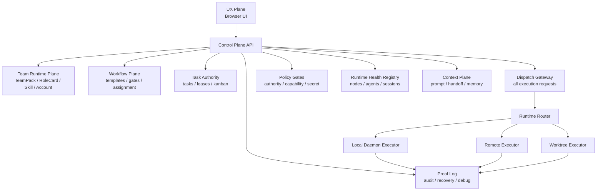

# System Control Plane

> Status: Draft for implementation
> Date: 2026-05-12
> Related sources: `team-runtime-contract/`,
> `docs/technical/execution/platform-harness-state-machine-design.md`,
> `group-chat-task-flow/`

## Problem Statement

Agent Task Hub has grown from a single UI-driven task workspace into a multi-instance agent system:

- browser UI instances create user turns and render runtime state
- the local daemon starts CLI runtimes and streams lifecycle events
- future remote runtimes may execute outside the local daemon process
- agents collaborate through A2A possession handoffs
- workflow, tasks, accounts, skills, worktrees, sessions, and runtime bindings all affect execution

The server-side Platform Harness now owns the execution loop boundaries:

- `taskHubStore` submits Human Commands and renders versioned projections only.
- Delivery Control Process Manager computes actions from authoritative owner facts.
- `A2ACollaborationRepository` owns possession, pass groups, policy admission and durable Inbox handoff.
- AgentInbox and Invocation Pipeline own reliable admission, preflight and Runtime start.
- Team Runtime remains the roster, communication-admission and executable-profile resolver; callers do not own a parallel policy object.

This creates system-level ambiguity:

- a dispatch can be treated as accepted before any runtime instance has acknowledged it
- a cross-instance target can be unreachable but still fail later as a generic timeout
- agent status is not a durable runtime binding fact
- socket broadcast events do not identify the exact receiving runtime node
- failure evidence is spread across UI memory, daemon logs, SQLite rows, and terminal output

The remaining scope of this spec is cross-node routing, health and proof. It must extend the existing
server-side Harness and owner boundaries, not reintroduce browser dispatch or a second A2A orchestrator.

## Design Principle

Agent Task Hub should be modeled as:

```text
Control Plane + Execution Plane
```

The control plane owns decisions and facts.

The execution plane owns side effects and reports lifecycle events.

UI, daemon, and remote runtimes are separate instances. Cross-instance actions must use explicit identity, session, envelope, health, and acknowledgement semantics.

## Goals

- Establish a single decision path for user dispatch, A2A handoff, workflow dispatch, review gates, and system-triggered execution.
- Treat browser, daemon, and remote runtimes as runtime nodes with identity and health.
- Track which runtime node currently owns each executable agent binding.
- Replace naked prompt dispatch and broadcast routing with typed execution envelopes.
- Record proof events for every critical state transition and dispatch phase.
- Keep Team Runtime as the source for roster, role, account, skill, workflow, and communication policy.
- Keep Task Authority as the source for task state and leases.
- Keep exactly one Conversation-owned `TASKS.md` compatibility projection per canonical-realpath runtime directory; watcher and mutex must share that same canonical key. Every server-side writer validates the claiming/owned lease inside a crash-released SQLite mutex and replaces projection files atomically. Malformed/unknown ownership fails closed. Legacy takeover is a recoverable three-phase protocol: commit `claiming` without touching the original bytes; import/quarantine and commit Tasks while only the matching daemon may read the claiming projection; then rebuild from committed Task Authority and publish `owned` in a new transaction. A new owner starts its watcher only after owned. Unknown post-claim rows are rejected and deleted/empty/mismatched membership is restored from Task Authority; new Tasks require the structured task command.
- Once a Task has entered WorkContract management, reject file-originated business-field changes and restore the authoritative projection so review/blocked states and frozen Gate revisions cannot be invalidated by a stale compatibility row.
- Make runtime failures explainable before they become generic timeouts.
- Allow future federation without forcing full zero-trust mesh complexity into the first implementation.

## Non-Goals

- This spec does not require full cryptographic federation in the first implementation.
- This spec does not require external organization trust management.
- This spec does not introduce 60+ agent types or a large MCP tool registry.
- This spec does not replace the A2A possession model; it moves delivery and runtime concerns below it.
- This spec does not make the UI a trusted source of execution facts.

## Architecture Overview



## Layers

### Layer 0: Proof Log

Proof Log records critical events before and after every decision or side effect.

It is append-only for normal operation and queryable for debugging.

Required event families:

- `dispatch.requested`
- `dispatch.blocked`
- `dispatch.routed`
- `dispatch.sent`
- `dispatch.started`
- `dispatch.failed`
- `dispatch.completed`
- `runtime.heartbeat`
- `runtime.stale`
- `runtime.unreachable`
- `agent.binding.updated`
- `task.state.changed`
- `a2a.pass.requested`
- `a2a.pass.accepted`
- `a2a.pass.rejected`
- `workflow.gate.opened`
- `workflow.gate.blocked`

Proof Log is not initially required to be hash-chained or HMAC-signed. It must still carry enough correlation fields to explain behavior:

- `eventId`
- `occurredAt`
- `conversationId`
- `taskId`
- `chainId`
- `passId`
- `envelopeId`
- `nodeId`
- `agentId`
- `actorId`
- `reasonCode`
- `metadata`

### Layer 1: State Authority

State Authority owns durable facts:

- tasks and task leases
- conversations
- runtime nodes
- runtime sessions
- agent bindings
- execution envelopes
- A2A chains, possessions, passes, and handoff packets
- workflow gates and checkpoints
- worktree lifecycle state

UI stores may cache this state but must not be treated as authoritative.

### Layer 2: Policy Gates

Policy Gates decide whether an action is allowed.

Initial gates:

- `IdentityGate`: actor and source instance are known.
- `SessionGate`: cross-instance action has a valid runtime session when required.
- `AuthorityGate`: actor can request the operation.
- `TeamPolicyGate`: Team Runtime communication and workflow rules allow it.
- `PossessionGate`: only the current A2A holder can pass the ball.
- `HealthGate`: target runtime node and agent binding are reachable.
- `SecretGate`: outgoing envelope does not leak credentials or private keys.
- `BudgetGate`: chain depth, breadth, time, retry, and cost budgets are respected.
- `DedupGate`: idempotency and duplicate dispatch rules are respected.

Gate decisions must be deterministic and recorded in Proof Log.

### Layer 3: Team Runtime Plane

Team Runtime remains the canonical resolver for:

- active roster
- role cards
- account bindings
- skill bindings
- runtime profiles
- communication policy
- workflow policy
- prompt-layer team context

Control Plane consumers must use Team Runtime outputs instead of importing frontend roster assumptions.
Browser execution affordances follow the same rule: they consume the Store-cached `RuntimeAgentProfile` and must not reconstruct account readiness, provider routing, or fallback engines inside a component or Store slice.

### Layer 4: Dispatch Plane

Dispatch Gateway is the only component that turns an intent into an execution attempt.

Inputs:

- user direct dispatch
- A2A pass intent
- workflow task assignment
- review gate request
- scheduled/system trigger

Outputs:

- `blocked`
- `queued`
- `routed`
- `sent`
- `started`
- `failed`
- `completed`

No caller may mark a dispatch as started until the target executor returns a lifecycle acknowledgement.

### Layer 5: Runtime Routing Plane

Runtime Router maps an execution envelope to a target runtime node.

Routing is directed, not broadcast.

The router must know:

- target `agentId`
- target `nodeId`
- runtime kind
- endpoint or socket room
- current session
- health status
- supported capabilities

### Layer 6: Continuation Plane

Continue Gate decides whether an active run should continue, checkpoint, pause, pass, or stop.

`ContinueGateLite` owns the first production continuation seam. An Agent may submit
`continue_work` only with a versioned checkpoint containing a concise summary, the exact next
action, and a non-empty remaining-step list. The admission transaction validates that checkpoint
before accepting it. After the Invocation terminates, Control Snapshot projects
`continuation_pending`; Control Decision emits a dedicated `continue` action, and the Command
Adapter starts a fresh fenced WorkContract epoch with the checkpoint in its recovery prompt.

Execution, Task review, Delivery review, and acceptance-verification WorkContracts all authorize
the same bounded continuation checkpoint; Gate evaluators do not have to misreport an incomplete
multi-step verification as a runtime failure. An accepted continuation is planned progress, not an Invocation failure. It does not consume the
runtime-failure retry budget and must not use the generic `retry` action or
`invocation_completed_without_outcome` reason. Continuations are independently bounded per Work;
when the continuation budget is exhausted, the run escalates to a visible human boundary instead
of looping forever. An accepted continuation consumes the current WorkContract's single accepted
exit slot. A terminal outcome, handoff, or blocker can only be submitted before that acceptance or
from the fresh fenced continuation epoch; the repository never accepts both in one Contract. A queued continuation reserves the same durable role/global slot as an
activation or retry until Inbox cancellation, expiry, Invocation start, or Invocation termination
releases it. Historical accepted `continue_work` rows that do not satisfy the versioned checkpoint
schema remain on the legacy Invocation retry path; they are never silently reinterpreted as a new
continuation.

`ContinueGateLite` owns Delivery-run continuation only. For a standalone or A2A WorkContract with
no Delivery run, admission MUST atomically create one idempotent continuation Inbox command before
returning accepted. The command keeps the stable Work id, execution mode/subject, frozen execution stage and, when present, the active A2A chain and
Possession revision; the Invocation pipeline creates the new fenced epoch when it consumes that
command. A standalone Work may accept at most three continuations. Exhaustion is rejected before
the Contract exit slot is consumed.

`handoff_to_agent` is a terminal, event-driven delegation outcome rather than a polling
checkpoint. WorkContract admission and the A2A outcome process manager MUST use the same parser
and normalization rules for every branch, including evidence references. A handoff that cannot be
executed is rejected before it consumes the terminal-outcome slot; an accepted handoff MUST be
projected as dependency waiting until the bounded A2A result callback opens a fresh fenced epoch for
the original holder. The delegating Agent MUST NOT submit `continue_work` merely to poll the
receiver. Internal protocol failures such as `invocation_completed_without_outcome` consume the
automatic recovery budget and terminate as a system failure when exhausted; they are not human
business decisions and MUST NOT transition the Delivery to `waiting_human`.
Completion without an accepted Outcome uses a dedicated one-attempt `outcome_recovery` budget,
not the ordinary Invocation retry budget. The recovery activation keeps the same stable Work id
but opens a fresh fenced epoch, supplies the previous turn's durable output and authoritative
context, and authorizes only the WorkContract's single-intent lifecycle tools. It MUST NOT grant native
edit/execute permission or Skill tools, and its prompt MUST ask the Agent only to select and submit
one allowed structured exit; it must not re-run implementation or verification. A recovery turn
that also terminates without an accepted Outcome, or fails at Runtime, is authoritative internal
failure evidence and terminates the Delivery without a second recovery turn or human escalation.
The Command Adapter MUST treat the exact exhausted failure projected for the target Work epoch as
authoritative termination evidence. It MUST NOT require that an exhausted retryable Work Cell has
already changed to the separate `failed` state, and an adapter rejection of that internal
termination MUST NOT be reclassified as a human-recoverable business decision.
The boundary normalizes the workflow-facing `quality_gate` alias to the canonical A2A `verify`
intent so Team workflow vocabulary cannot create an asynchronous schema dead letter.
Admission creates the normalized PassGroup, Possession transition, and receiver Inbox commands in
the same SQLite transaction as the accepted outcome. Duplicate receivers, stale/missing source
Possessions, cycles, hop-budget violations, and routing-policy failures therefore produce a
rejected, correctable outcome with no partial A2A aggregates. The durable outcome handler is an
idempotent recovery path for already-created groups, not the first place deterministic invariants
can fail.
The recovery handler uses revision `v2` so historical `v1` dead letters are replayable after the
normalization fix. It ignores handoffs superseded by a later accepted Work epoch, verifies the full
normalized request digest before treating an existing group as an idempotent replay, and rejects a
reused group key whose targets or packet content changed.

Initial signals:

- holder turn count
- elapsed time
- output length
- repeated failed dispatches
- unresolved blockers
- budget consumption
- explicit handoff intent
- task completion signal

For A2A, this supports multi-turn holder buffers and compact handoff packets.

For workflow, this supports post-task checkpoints and gate transitions.

### Layer 7: UX Plane

UX Plane renders state and sends intents.

It must not:

- decide that a cross-instance dispatch succeeded
- infer runtime reachability from local UI status alone
- own Team Runtime resolution rules
- mutate durable task state without Control Plane confirmation

It may:

- show optimistic input state
- subscribe to proof and runtime events
- render explicit failure phases and recovery actions

## Core Domain Types

```typescript
type RuntimeNodeKind = 'browser' | 'daemon' | 'remote' | 'worktree';

type RuntimeNodeStatus = 'reachable' | 'stale' | 'unreachable' | 'suspended';

interface RuntimeNode {
  id: string;
  kind: RuntimeNodeKind;
  label: string;
  endpoint?: string;
  status: RuntimeNodeStatus;
  capabilities: string[];
  trustLevel: 'local' | 'paired' | 'verified' | 'trusted' | 'privileged';
  lastHeartbeatAt?: string;
  missedHeartbeats: number;
  createdAt: string;
  updatedAt: string;
}

type AgentBindingStatus = 'idle' | 'busy' | 'unreachable' | 'misconfigured' | 'suspended';

interface AgentBinding {
  id: string;
  conversationId: string;
  agentId: string;
  nodeId: string;
  runtimeId: string;
  status: AgentBindingStatus;
  activeEnvelopeId?: string;
  lastStartedAt?: string;
  lastFinishedAt?: string;
  lastError?: string;
  updatedAt: string;
}

type DispatchSource = 'user' | 'a2a' | 'workflow' | 'review_gate' | 'system';

type DispatchIntent =
  | 'answer'
  | 'implement'
  | 'review'
  | 'verify'
  | 'plan'
  | 'delegate';

interface ExecutionEnvelope {
  id: string;
  source: DispatchSource;
  intent: DispatchIntent;
  conversationId: string;
  taskId?: string;
  chainId?: string;
  passId?: string;
  fromNodeId: string;
  fromAgentId?: string;
  toNodeId: string;
  toAgentId: string;
  payload: {
    prompt?: string;
    handoffPacketId?: string;
    contextRefs: string[];
  };
  ttlMs: number;
  nonce: string;
  status:
    | 'drafted'
    | 'validated'
    | 'blocked'
    | 'queued'
    | 'routed'
    | 'sent'
    | 'started'
    | 'acknowledged'
    | 'rejected'
    | 'failed'
    | 'completed'
    | 'expired';
  reasonCode?: string;
  createdAt: string;
  updatedAt: string;
}
```

### ExecutionEnvelope schema compatibility

During the Platform Harness state-machine rollout, a persistent data directory may
already expose the acknowledgement-only envelope schema while a development daemon
is still running the compatibility control-plane code. The repository must inspect
the actual `execution_envelope` table contract before mutating lifecycle state:

- legacy tables keep the execution lifecycle
  `drafted → routed → sent → started → completed/failed`;
- tables with `revision` and `settled_at` use the admission lifecycle
  `drafted → validated → routed → sent → acknowledged`;
- legacy `blocked/failed` calls before acknowledgement map to `rejected` with a
  reason; execution completion/failure after acknowledgement updates binding and
  proof only and must not reopen the terminal envelope;
- autonomy recovery treats pre-acknowledgement envelopes and non-terminal
  Invocations as the active-dispatch facts, so `acknowledged` neither suppresses
  recovery forever nor causes a duplicate wakeup while execution is still running;
- daemon startup settles non-terminal Invocations left by a previous process,
  and every runtime success, runtime failure, timeout, or setup-failure
  path settles the Invocation created by that attempt;
- lifecycle methods report whether a transition was applied; daemon
  `project:view(type=dispatch.receipt)` events are emitted only for applied transitions, so late,
  duplicate, expired, and rejected callbacks cannot become UI lifecycle truth;
- terminal Invocation outcomes are monotonic: runtime-session confirmation and
  other late callbacks cannot reverse a prior timeout or failure;
- TTL expiry must populate `settled_at` and increment `revision` on the upgraded
  schema.

This is a temporary compatibility path for development servers and persisted data
that cross the schema rollout boundary. Remove it once every supported branch uses
the acknowledgement-only repository and daemon contract.

### Invocation schema compatibility

The same development data directory can expose the managed Invocation lifecycle
before every daemon branch has adopted it. Invocation persistence must inspect the
actual table contract instead of relying on the migration watermark:

- legacy tables use `queued/running/succeeded/failed`;
- tables with `outcome`, `started_at`, `terminated_at`, and `revision` use
  `planned → starting → running → terminating/terminated`;
- legacy completion states map to terminal outcomes:
  `succeeded → completed`, ordinary `failed → failed`, cancellation failures
  `→ cancelled`, and timeout failures `→ timed_out`;
- runtime-session confirmation may enrich an active managed Invocation but must
  not settle it or reverse an existing terminal outcome;
- daemon restart settlement terminates every managed non-terminal Invocation with
  outcome `failed` and reason `process_restarted`;
- managed terminal state is monotonic and cannot be reopened by late callbacks.

This compatibility is required whenever a newer branch has already migrated the
shared development database but an older daemon branch is selected for local work.

## Dispatch Gateway Pipeline

```text
DispatchIntent created
  ↓
Normalize actor, source, conversation, task, target
  ↓
Resolve Team Runtime target profile
  ↓
Resolve AgentBinding and RuntimeNode
  ↓
Run gates in deterministic order
  ↓
Build ExecutionEnvelope
  ↓
Record proof: dispatch.routed
  ↓
RuntimeRouter sends envelope to target node
  ↓
Executor ACKs started / rejected / failed
  ↓
Update envelope, binding, task/pass state
  ↓
Record proof event
```

Gate order:

1. `IdentityGate`
2. `SessionGate`
3. `AuthorityGate`
4. `TeamPolicyGate`
5. `PossessionGate`
6. `HealthGate`
7. `SecretGate`
8. `BudgetGate`
9. `DedupGate`

Gate order matters. A missing runtime target should not be reported as an A2A timeout. A communication policy block should not be masked by breadth limits. A duplicate should not be sent to a remote node.

## Runtime Health

Runtime nodes must heartbeat independently from agent output streams.

Initial policy:

- heartbeat interval: 5 seconds
- stale threshold: 2 missed heartbeats
- unreachable threshold: 3 missed heartbeats
- suspended threshold: repeated start failures or circuit breaker policy

Health is tracked per runtime node and per agent binding.

The existing long stream watchdog remains useful for active process output but does not replace Runtime Health.

## Cross-Instance Semantics

A cross-instance action requires:

- source node identity
- target node identity
- an execution envelope
- a runtime session or local pairing
- a lifecycle acknowledgement
- proof events

Socket broadcast events are not sufficient for delivery semantics.

During migration, the system may keep compatibility events such as `a2a:dispatch`, but the Control Plane must treat them as transport adapters, not as the source of truth.

## A2A Integration

A2A Possession remains responsible for collaboration semantics:

- current holder
- pass intent
- handoff packet
- holder buffer
- pass status

System Control Plane becomes responsible for delivery semantics:

- whether the pass is allowed
- where it should route
- whether the target runtime is reachable
- whether the target acknowledged start
- why delivery failed

A2A must submit pass intents to Dispatch Gateway instead of owning the full runtime delivery chain.

### Parallel collaboration callback contract

- A single pass group may address at most three distinct agents. Wider work must first be decomposed into bounded task or pass groups; breadth rejection uses `a2a_pass_group_too_wide`.
- An Agent-owned handoff never ends merely because its receiver Invocation ended, including a successful one-to-one transfer: after all branches settle, the aggregate opens one source reconciliation Possession and durably enqueues the original holder on the same `sourceWorkId`. Human-originated commands have no executable source Work and therefore preserve direct completion semantics while exposing complete/partial branch facts.
- The reconciliation command carries a deterministic result bundle capped at 24,000 characters, containing each branch's pass id, target agent, requested action, terminal status, bounded result summary or failure reason, and exact accepted outcome evidence refs. Missing accepted-outcome alignment is explicit rather than indistinguishable from an outcome with no evidence. It must not copy the full conversation or every branch transcript.
- Partial failure still returns successful branch results. The original holder decides the next structured outcome from the complete/partial bundle instead of restarting finished branches.
- The reconciliation Inbox command is idempotent by group and Possession. Its WorkContract carries an authoritative `a2a_possession:<id>` ref and frozen Possession revision. Dispatch and outcome admission both require the same project, holder, active chain, open status, and revision. Aborting or superseding a chain cancels every pending chain Inbox item and closes any active callback WorkAuthority, so a claimed, queued, or already-authorized stale callback cannot start new Agent/tool work or mutate Task/Gate/A2A facts after restart.
- PassGroup replay is bound to the exact accepted outcome id and Work epoch that created it. The same handoff key in a later callback epoch is a new command and must be rejected as an idempotency conflict rather than silently attached to the earlier group.
- Result-bundle text is input to the normal ContextManager pipeline, not a second prompt assembler. Context scope, required context, budget, and runtime snapshot rules remain authoritative.

## Workflow Integration

Workflow Engine submits dispatch intents to Dispatch Gateway.

Workflow gates must not start agents directly.

Task completion checkpoints should be represented as proof events and workflow gate transitions.

## Task Authority Integration

Task Authority owns task state, assignment, and leases.

Dispatch may reference a task but must not directly mutate task state without Task Authority.

When Group Chat Task Flow is enabled, Task Authority includes the Task Graph contract:

- task nodes
- task edges
- task action events
- blockers
- artifact refs
- split and merge lineage
- reopen history

Planning WorkContracts freeze the current Task Graph revision. The public `task_propose_graph` MCP
schema exposes canonical task fields while the platform injects that frozen revision. Admission
MUST call the Task Graph owner and commit deterministic graph effects in the same transaction as
the accepted outcome. Every WorkContract that exposes this tool MUST freeze the same authority, and
the owner MUST compare the payload revision to the frozen value. It may assign existing unassigned `proposed`/`ready` WorkItems without
changing identity, but MUST reject project-external assignees, stale revisions, cycles, and attempts
to rewrite executing, review, blocked, or terminal Tasks. For non-Delivery proposals, all assigned
dependency-ready Tasks are enqueued before an applied receipt is returned. The durable outcome
handler is an idempotent historical recovery path, including v1 event-id commit identities, missing
frozen results, and pre-authority Contracts, not the initial mutation boundary. An old accepted
proposal without a commit may use its payload revision only in this recovery path and remains stale-fenced.
Dependency wakeup and delayed outcome replay use the latest graph commit touching the Task, so an
older standalone proposal cannot override a later Delivery-owned or direct graph mutation.

The group chat UI may render task capsules and action cards, but durable task state changes must be recorded as task actions.

Task status transitions caused by runtime lifecycle events must go through Control Plane:

- start may move task to `in_progress`
- successful completion may move task to `in_review` or workflow-defined next state
- runtime failure may open blocker state
- timeout may mark lease expired or task blocked

Task graph transitions caused by A2A must also go through Control Plane:

- task-linked passes record task action events instead of changing ownership from chat text
- high-impact graph operations such as merge and cancel require confirmation
- non-owner reassignment of a running task requires confirmation before `task.claimed`
- blocked task-graph policy decisions are recorded as `task_graph.policy.blocked` proof events

- `task.handoff_requested` may create an A2A pass intent
- receiver start acknowledgement may record `task.handoff_accepted`
- blocked or rejected delivery may record a task blocker or failed handoff action
- review failure may create a reopen or corrective task action

## Context Plane Integration

Context Plane builds execution payloads from durable references:

- user turn
- task graph node and edge references
- task state
- team runtime profile
- role card
- skills
- handoff packet
- recent conversation summary
- relevant memory or knowledge refs

Execution envelopes should carry references and compact payloads, not uncontrolled full chat history.

## Security and Privacy

Initial implementation must include a lightweight `SecretGate`.

The gate should block or redact obvious sensitive material in cross-agent and cross-instance envelopes:

- API keys
- bearer tokens
- private keys
- database URLs
- GitHub tokens
- provider credentials

Future federation may extend this to a full PII pipeline and trust-level matrix.

## Migration Strategy

### Phase 1: Specification and Proof First

- Add this spec.
- Add `ProofLog` schema and repository.
- Record dispatch and runtime lifecycle events without changing all routing yet.

### Phase 2: Runtime Registry

- Add `RuntimeNodeRegistry`.
- Add `AgentBindingRegistry`.
- Register local daemon and browser client nodes.
- Track heartbeat independently from stream watchdogs.

### Phase 3: Dispatch Gateway

- Introduce `DispatchGateway`.
- Route user direct dispatch through the gateway.
- Route A2A handoff through the gateway.
- Keep compatibility transport events during migration.

### Phase 4: Executor Envelope

- Make daemon consume `ExecutionEnvelope`.
- Make future remote executors consume the same envelope shape.
- Return `started`, `failed`, and `completed` lifecycle events.

### Phase 5: Continue Gate

- Add `ContinueGateLite`.
- Use it for A2A holder buffers and workflow checkpoints.

### Phase 6: Federation-Ready Extensions

- Add runtime sessions, trust levels, circuit breaker, and stronger envelope signatures where needed.

## Current Implementation Status

- The P0 persistence layer has landed in migration version 17.
- `control_proof_event` stores append-only proof events with envelope, node, agent, conversation, task, chain, and pass correlation fields.
- `runtime_node` stores runtime node identity, kind, status, trust level, capabilities, heartbeat timestamp, and missed heartbeat count.
- `agent_binding` stores conversation-scoped agent-to-runtime-node bindings and active envelope state.
- `execution_envelope` stores normalized execution envelopes with source, intent, route, payload, TTL, nonce, lifecycle status, and reason code.
- Repository modules exist for proof events, runtime nodes, agent bindings, and execution envelopes.
- Targeted repository tests cover migration existence, heartbeat miss/recovery, binding lifecycle, envelope lifecycle/expiry, and proof timeline queries.
- A lightweight `DispatchGateway` now creates execution envelopes, records proof events, checks target runtime health, and applies a first-pass secret gate.
- The local daemon registers itself as `daemon:local`; browser clients are not runtime nodes.
- Runtime health scan marks non-heartbeating nodes stale after 2 missed intervals and unreachable after 3 missed intervals.
- Human/Task Commands reach the durable Inbox and Invocation Coordinator, which creates the envelope and proof timeline.
- `terminal:start` / `terminal:kill` compatibility transport is removed; proposal admission is owned once by Invocation Planner for durable Inbox, retry, and restart paths.
- Gate evaluation work uses a Gate-scoped Work identity. The identity contains the Task or Delivery target, evaluator Agent, exact
  `gateId`, and purpose. A closed authority from an earlier artifact revision is historical evidence, never the current Gate's
  liveness signal. The control snapshot must synthesize a fresh ready Work Cell for every requested/evaluating Gate that has no
  current Invocation or accepted decision outcome.
- Work identity parsing/building is owned by one deep server module; the snapshot builder, command adapter, WorkContract issuer,
  and Gate lifecycle owner must not maintain independent string heuristics.
- A rollout that changes Work Cell projection or scheduling semantics increments the Delivery control policy revision. Persisted
  decisions from the prior projection remain immutable, while the same owner-fact revision can converge under a new decision id.
- Once a Task artifact is in review, its latest requested/evaluating Gate remains independently schedulable by exact `gateId` even
  if non-artifact Task metadata changes or the implementer assignment is cleared. Assignment is not artifact identity, and cannot
  silently discard a submitted review cycle.
- Every semantic Task mutation that increments Task revision publishes a Task owner event in the same transaction. Control
  snapshots must not read mutable Task facts whose changes are invisible to the project snapshot revision used in Decision identity.
- Gate Work dispatch resolves the evaluator from the structured Work identity. The target Task supplies artifact context, but its
  current implementer assignment is not an admission requirement for an independent reviewer or verifier Invocation.
- Terminal Task cleanup cancels ordinary execution/correction Inbox items but preserves Delivery-scoped review and verification
  Work, which is intentionally created after Tasks are done. Inbox cancellation/expiry releases any applied Control slot by Work id;
  periodic recovery also reconciles already-terminal Inbox rows so a deployment does not depend on replaying old cancellation events.
- Delivery Gate Outcome admission validates the same top-level review/verification receipt schema used by the Gate Process Manager.
  A missing or invalid receipt is rejected before consuming the WorkContract terminal slot, and the dispatch prompt supplies the
  exact required schema plus acceptance criteria so the Agent can correct and resubmit.
- Durable Inbox liveness is part of the Work Cell projection. A Work with an enqueued/released/claimed Inbox item is
  `queued`, not `ready`; Control Decision emits `dispatch_pending` and cannot create another activation for the same Work id.
  Once admitted, WorkContract/Invocation facts own liveness so a terminal Invocation can still project retry or completion.
- `request_human_decision` and Task-execution `report_blocked` are different control facts. An accepted
  `request_human_decision` projects `waiting_human` immediately. An accepted execution `report_blocked` records a structured
  blocker and leaves the Task blocked; it must not itself wake the same Agent or consume Invocation retry budget. A server-owned
  `BlockedRecoveryOwner` may move the Task back to `ready` only after a deterministic probe proves that the named recovery
  condition is now satisfied. Unknown, malformed, unchanged, or Gate-evaluator blockers fail closed and remain visible instead
  of looping; Gate blocker recovery stays human-owned until a Gate-specific probe exists.
- A terminal Task event closes only Task-scoped Work Authorities and cancels their pending or claimed Inbox commands, preserving Delivery
  review/verification Work. A terminal Delivery event closes every Work Authority whose current WorkContract belongs to that
  Delivery and cancels its pending or claimed Inbox commands. Owner-terminal cancellation clears any outstanding Inbox lease;
  `work.authority.closed` releases the corresponding applied Control slot.
  Historical terminal events are replayed through the durable Process Manager so rollout also repairs pre-existing orphan Work;
  a durable `agent.work.enqueued` guard cancels commands that race and arrive after owner termination.
  Cancellation is selected from the Inbox command's Task/Delivery scope even when context planning has not issued a WorkContract yet.
  WorkContract issue re-reads owner state inside its transaction and rejects terminal Task/Delivery owners, closing the final
  claim-before-contract race. A done Task may still be attached as read-only context to Delivery-scoped review/verification Work;
  that Work is governed by the Delivery owner, not rejected by the Task terminal guard.
- Control capacity is reserved by the pre-issue Work epoch, while the new WorkContract/Invocation owns the next epoch. Runtime
  start, Inbox terminal, and Authority close release the exact causal Control action id carried through Inbox idempotency and
  WorkContract causation; epoch-minus-one matching is only a legacy fallback.
- `ContinueGateLite` validates versioned `continue_work` checkpoints and projects accepted checkpoints as bounded
  `continuation_pending` Work. Control emits a dedicated `continue` action whose next Invocation receives the summary, exact next
  action, remaining steps, and evidence references. Planned continuation is separate from failure retry accounting; exhausting its
  own budget escalates visibly instead of becoming a fake runtime failure.
- Existing A2A compatibility dispatch passes chain/pass metadata into the execution envelope.
- Task Graph policy now writes proof events for blocked high-impact actions and keeps task action ids correlated through task/pass fields where available.
- Local directed routing and executor-only envelope admission are implemented by `DirectedAgentRuntime`;
  multi-node remote transport consumption remains future work and fails closed today.

## Acceptance Criteria

- A dispatch cannot be marked as started without executor acknowledgement.
- An unreachable target is blocked before dispatch and shown as a health failure, not a generic timeout.
- A2A handoff and direct user dispatch use the same gateway path.
- Runtime node and agent binding state are visible in debug UI or diagnostics.
- Every dispatch has a proof timeline with requested, gated, routed, sent, started, and terminal states where applicable.
- A blocked Task cannot redispatch from `task.blocked` alone; a recovery requires a persisted accepted blocker plus a satisfied,
  reason-coded machine probe, and the recovery action is idempotent for the blocker Outcome and Task revision.
- An execution capability means its required Skill is currently available, not merely that Task text requests it. Blocked recovery
  compares the frozen WorkContract profile with this ready-capability profile so a Skill binding/configuration delta is provable.
- Terminal Task and Delivery owners leave no in-scope active Work Authority, pending Inbox item, or applied Control slot after
  durable event processing; late runtime writes are rejected by the closed Work epoch rather than being falsely settled.
- A second review cycle for the same Task and reviewer autonomously creates a new Invocation and cannot be stranded by the prior
  Gate's closed Work Authority.
- UI store no longer acts as the authoritative source for cross-instance delivery success.
- Existing Team Runtime and A2A Possession semantics remain intact.
